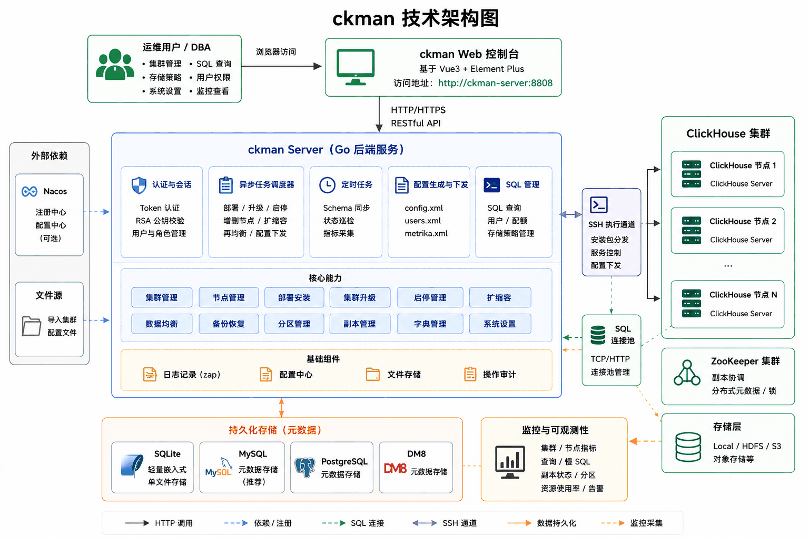

[ENGLISH](./README.md) | 简体中文

# CKMAN — ClickHouse 集群管理平台

[](./LICENSE)
[](https://github.com/housepower/ckman/releases)
[](https://housepower.github.io/ckman/)
[](https://github.com/housepower/ckman/stargazers)

> 官方站点：**<https://housepower.github.io/ckman/>**

**CKMAN** 是面向企业的 **ClickHouse** 集群管理 Web 控制台。部署、升级、扩缩容、监控、备份、治理 —— 一个统一界面，告别逐台 SSH。

<p align="center">
  
</p>

## 文档

- **官方站点**：<https://housepower.github.io/ckman/>
- **本地访问**：启动 ckman 后访问 `http://<ckman-host>:8808/docs/`
- **源码**：[`website/`](./website)

## 核心能力

- **集群全生命周期** — 部署 / 升级（含滚动）/ 销毁 / 启停 / 节点增删，Web 与 API 双通道
- **原生监控** — 直读 ClickHouse 系统表，开箱即用；可选接入 Prometheus / Grafana
- **表与数据治理** — 分布式表、分区、TTL、物化视图、DML、归档、purge
- **数据备份与恢复** — 定时策略、增量去重，支持本地与 S3 存储目标
- **角色权限** — 三级 RBAC（管理员 / 普通用户 / 游客）+ JWT + 客户端 IP 绑定 + 统一门户 token
- **高可用部署** — 多实例 + Nacos 主节点选举 + MySQL / PostgreSQL / DM8 / SQLite 持久层
- **ckmanctl CLI** — 持久层迁移、ZooKeeper 维护、schema 升级等运维工具
- **多种发行格式** — rpm / deb / tar.gz / Docker / Kubernetes

## 快速开始

```bash
docker run -itd -p 8808:8808 --restart unless-stopped \
  --name ckman quay.io/housepower/ckman:latest
```

浏览器打开 `http://localhost:8808`，默认账号详见[快速开始](https://housepower.github.io/ckman/docs/guide/quick-start.html)。其他发行方式（rpm / deb / tar.gz / Kubernetes）见[安装指南](https://housepower.github.io/ckman/docs/deploy/install.html)。

## 源码构建

```bash
make build VERSION=x.x.x        # 完整构建（前端 + 文档 + 后端）
make package VERSION=x.x.x      # 打 tar.gz
make rpm VERSION=x.x.x          # 打 rpm
make deb VERSION=x.x.x          # 打 deb
```

依赖：Go ≥ 1.17、Node ≥ 18、yarn，构建 rpm/deb 需 [nfpm](https://github.com/goreleaser/nfpm)。

## 视频教程

- [B 站 — ClickHouse 可视化管理工具 ckman 使用教程](https://www.bilibili.com/video/BV1gR4y1t75Q/)
- [头条 — ClickHouse 可视化管理工具 ckman 使用教程](https://www.ixigua.com/7034858546692882983)

## 架构与概念

参见[架构设计](https://housepower.github.io/ckman/docs/guide/architecture.html)与[核心概念](https://housepower.github.io/ckman/docs/guide/concepts.html)。

## 贡献

欢迎提 Issue 与 Pull Request，请在 PR 描述中说明动机与影响范围。维护者：**陈衍长**（微信：`yudinghou`）。

## 关于我们

上海擎创信息技术有限公司 — 国内 AIOps 落地解决方案供应商。CKMAN 由数据库研发团队主导研发并开源贡献给社区。

<!-- TODO: 公众号二维码图片，可补到 website/public/img/community/qr.jpg 并在此处引用 -->

## 协议

Apache License 2.0 — 详见 [LICENSE](./LICENSE)。
