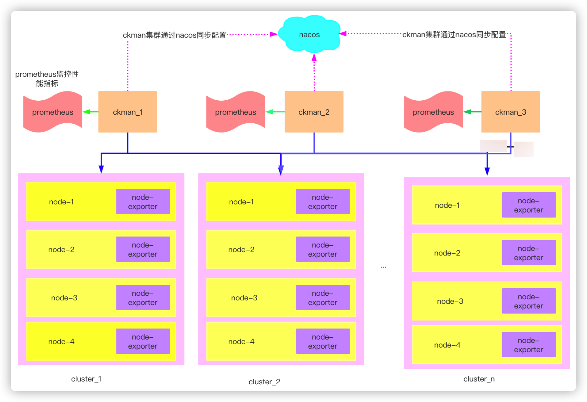
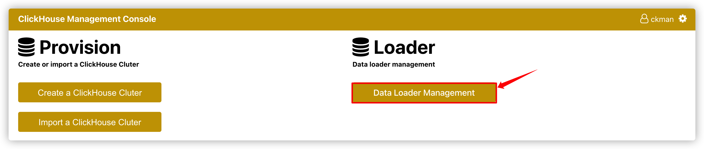
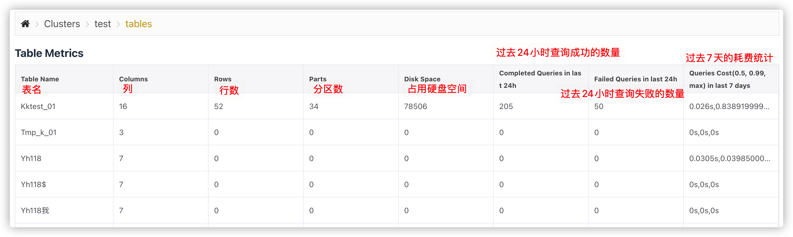

# ckman介绍

`ClickHouse`作为`OLAP`场景特别优秀的数据库解决方案，写入速度快，查询性能强，尤其是聚合查询能力特别出色，已在腾讯、哔哩哔哩、快手等公司得到有效实践。与此同时，`ClickHouse`在集群部署时配置复杂，流程繁琐也困扰着广大使用者。在此背景之下，`ckman`应运而生。

`ckman`（`ClickHouse Manager`）是由擎创信息科技公司自主研发的一款管理`ClickHouse`的工具。它主要用来管理`ClickHouse`集群、节点以及数据监控等，致力于服务`ClickHouse`分布式的操作以及管理。同时提供简单的数据查询窗口。

通过网页端的可视化界面，`ckman`可以非常便捷的完成集群的导入、部署、节点的增删以及性能指标的监控等功能，可以大大简化集群部署的操作流程，从而起到事半功倍的效果。

如今，这款工具已经在`github`上开源啦！有想要体验的同学可以移步 https://github.com/housepower/ckman，欢迎`star`和贡献代码。


# ckman架构



ckman支持多中心部署，使用nacos进行配置同步，可以对多个集群进行管理，在集群的每个节点下，如果配置node_exporter，则可以对对应的节点进行指标监控。node_exporter的数据传给prometheus，然后在前端展示。

# ckman编译

## Linux & MacOS下编译

### 编译环境配置

1.  安装Node.js

由于ckman将前端代码静态嵌入到了server中，因此需要安装Node.js以编译前端代码：

MacOS上安装Node.js:

```bash
brew install node
```

Linux下安装Node.js:

```bash
yum install -y nodejs
```

安装完成后，在frontend目录下执行：

```
cd frontend
sudo rm -rf node_modules package-lock.json && npm install
```

2.  安装pkger

```bash
go get github.com/markbates/pkger/cmd/pkger
```

3.  安装 nfpm2.2.4:

nfpm是一款用来打包rpm的工具，如果不打算做成rpm包，可以不安装。

由于nfpm新版本配置文件和旧版本差别很大，建议安装指定的2.2.4版本。

```
wget -q https://github.com/goreleaser/nfpm/releases/download/v2.2.4/nfpm_2.2.4_Linux_x86_64.tar.gz
tar -xzvf nfpm_2.2.4_Linux_x86_64.tar.gz
cp nfpm /usr/local/bin
```

### 编译命令

Linux和MacOS下编译命令都是一样的：

```bash
make package VERSION=1.2.5   
```

以上命令会编译成打包成一个tar.gz安装包，该安装包解压即可用。

### rpm编译

```bash
make rpm
```

## Docker编译

鉴于编译环境的诸多依赖，配置起来可能比较麻烦，因此也提供了docker编译的方式，直接运行下面的命令即可：

```bash
make docker-build VERSION=1.2.5
```

如果想利用docker编译rpm版本，可以先进入docker环境，再编译：

```bash
make docker-sh
make rpm
```


# ckman安装部署

`ckman`部署分为`rpm`包安装和`tar.gz`包安装。其实只是提供的安装包不一样，实际安装还是一样的。

## rpm安装

### 安装

`rpm`安装直接使用命令安装即可：

```bash
rpm -ivh ckman-1.2.5.x86_64.rpm
```

安装完成后，在`/etc/ckman`目录下，会生成工作目录（日志和配置文件等都在该目录下）。

### 启动

`rpm`方式安装的`ckman`有两种启动方式：

#### 方式一：

```bash
/usr/local/bin/ckman -c=/etc/ckman/conf/ckman.yaml -p=/run/ckman/ckman.pid -l=/var/log/ckman/ckman.log -d
```

#### 方式二：

```bash
systemctl start ckman
```

## tar.gz包安装

### 安装

可以在任意目录进行安装。安装方式为直接解压安装包即可。

```bash
tar -xzvf ckman-1.5.0-201216-6b03a3a.Linux.x86_64.tar.gz
```

### 启动

进入`ckman`的工作目录，执行：

```bash
cd ckman
bin/start
```

启动之后，在浏览器输入 http://localhost:8808  跳出如下界面，说明启动成功：


## ckman配置文件

`ckman`的配置文件在`ckman` 的工作目录下的`conf/ckman.yml`。

| 一级选项     | 二级选项          | 默认值                             | 说明                                                     |
| ------------ | ----------------- | ---------------------------------- | -------------------------------------------------------- |
| `server`     | `id`              | `1`                                | `ckman`集群`id`，同一个集群的`ckman`的`id`号配置必须不同 |
|              | `port`            | `8808`                             | `ckman`默认的`http`端口                                  |
|              | `https`           | `false`                            | 是否支持`https`，默认为不支持                            |
|              | `pprof`           | `true`                             | 是否支持`pprof`监控，默认支持                            |
|              | `session_timeout` | `3600`                             | 会话超时（`token`失效）时间，默认为`1`个小时             |
|              | `publick_key`     |                                    | 接入擎创统一门户用来解析token的公钥                      |
| `log`        | `level`           | `INFO`                             | 日志级别，默认为`INFO`                                   |
|              | `max_count`       | `5`                                | 滚动日志数量                                             |
|              | `max_size`        | `10`                               | 单个日志大小，默认为`10M`                                |
|              | `max_age`         | `10`                               | 日志有效生命周期，默认为`10`天                           |
| `prometheus` | `hosts`           | `127.0.0.1:19090`                  | 普罗米修斯监控的`ip`和端口                               |
|              | `timeout`         | `10`                               | 普罗米修斯的超时时间                                     |
| `nacos`      | `enabled`         | `true`                             | 是否开启`nacos`，默认为`true`                            |
|              | `hosts`           | `127.0.0.1`                        | `nacos`服务的`ip`                                        |
|              | `port`            | `8848`                             | `nacos`服务的端口                                        |
|              | `user_name`       | `nacos`                            | 登录`nacos`的用户名                                      |
|              | `password`        | `0192023A7BBD73250516F069DF18B500` | 登录`nacos`的密码                                        |
|              | `namespace`       |                                    | 指定`nacos`的`namespace`，默认为`DEFAULT`                |
|              | `group`           | `DEFAULT_GROUP`                    | 向`nacos`注册的服务所处的组                              |
|              | `data_id`         | `ckman`                            | 向`nacos`注册的服务名称、数据项名称                      |


## 安装部署node_exporter和prometheus

参考文档： http://www.eryajf.net/2468.html

>   node_exporter和prometheus不一定要部署在同一台主机，在prometheus的配置文件中指定监控的node_exporter即可。
>
>   ```yaml
>   static_configs:
>       - targets: ['localhost:9100']
>   ```
>
>   node_exporter一般是用来监控系统性能指标的，因此一般是配置在各个节点上。
>
>   prometheus和ckman不一定要配置在同一台主机，在ckman配置文件中指定prometheus的地址和端口即可。
>
>   ```yaml
>   prometheus:
>     hosts:
>       - 192.168.21.73:9090
>   ```

# ckman功能说明

## ckman 支持的接口

| 接口                                        | method   | 说明                  |
| ------------------------------------------- | -------- | --------------------- |
| `/api/login`                                | `POST`   | 登录                  |
| `/api/logout `                              | `PUT`    | 退出登录              |
| `/api/v1/ck/cluster`                        | `GET`    | 获取所有集群信息      |
| `/api/v1/ck/cluster`                        | `PUT`    | 更新集群信息          |
| `/api/v1/ck/cluster`                        | `POST`   | 导入集群              |
| `/api/v1/ck/cluster/{clusterName}`          | `DELETE` | 删除集群              |
| `/api/v1/ck/destroy/{clusterName}`          | `PUT`    | 销毁集群              |
| `/api/v1/ck/get/{clusterName}`              | `GET`    | 获取指定集群的信息    |
| `/api/v1/ck/node/{clusterName}`             | `POST`   | 增加节点              |
| `/api/v1/ck/node/{clusterName}`             | `DELETE` | 删除节点              |
| `/api/v1/ck/open_sessions/{clusterName}`    | `GET`    | 获取有效`session`个数 |
| `/api/v1/ck/query/{clusterName}`            | `GET`    | 执行`Query`           |
| `/api/v1/ck/rebalance/{clusterName}`        | `PUT`    | `Rebanlance`集群数据  |
| `/api/v1/ck/slow_sessions/{clusterName}`    | `GET`    | 获取慢`SQL`查询       |
| `/api/v1/ck/start/{clusterName}`            | `PUT`    | 启动集群              |
| `/api/v1/ck/stop/{clusterName}`             | `PUT`    | 停止集群              |
| `/api/v1/ck/table/{clusterName}`            | `GET`    | 描述表                |
| `/api/v1/ck/table/{clusterName}`            | `PUT`    | 更新表                |
| `/api/v1/ck/table/{clusterName}`            | `POST`   | 创建表                |
| `/api/v1/ck/table/{clusterName}`            | `DELETE` | 删除表                |
| `/api/v1/ck/table_metric/{clusterName}`     | `GET`    | 获取表集群信息        |
| `/api/v1/ck/upgrade/{clusterName}`          | `PUT`    | 升级集群              |
| `/api/v1/config`                            | `GET`    | 获取配置              |
| `/api/v1/config`                            | `PUT`    | 修改配置              |
| `/api/v1/deploy/ck`                         | `POST`   | 部署`ck`              |
| `/api/v1/metric/query`                      | `GET`    | 获取`query`指标       |
| `/api/v1/metric/query_range`                | `GET`    | 获取范围指标          |
| `/api/v1/package`                           | `GET`    | 获取安装包列表        |
| `/api/v1/package`                           | `POST`   | 上传安装包            |
| `/api/v1/package`                           | `DELETE` | 删除安装包            |
| `/api/v1/zk/replicated_table/{clusterName}` | `GET`    | 获取复制表状态        |
| `/api/v1/zk/status/{clusterName}`           | `GET`    | 获取集群状态          |

## 登录

`ckman`默认的登录名为`ckman`， 密码为` Ckman123456!`

登陆成功后会得到一个`token`，该`token`在1个小时内有效，`token`失效后需要重新登录。

登陆成功后会进入如下所示的主页：


在主页上，除了有创建集群和导入集群等操作按钮外，还有集群展示的列表。

这个集群列表是通过`ckman`工作目录下`conf/clusters.json`文件导入进来的。主要展示集群名、是否支持副本、节点ip、节点数量、zk节点等信息。

重点说下`clusters.json`这个文件。

如下所示，为一个`clusters.json` 的示例文件。

```json
{
  "ck_cluster_config_version": 5,	# 配置版本，如果配置了多中心部署，会从nacos上同步集群配置，版本号大的会覆盖版本号小的
  "test": {		#集群名称
    "mode": "import",	#集群的模式，import表示是导入的集群，还有deploy，表示是通过部署的，import的集群只能查看，不能操作，deploy的集群可以查看和操作
    "hosts": [	#ck节点ip列表
      "192.168.101.40",
      "192.168.101.41",
      "192.168.101.42",
      "192.168.101.57"
    ],    #ck节点的hostname
    "names": [
      "vm10140",
      "vm10141",
      "vm10142",
      "zhanglei01"
    ],
    "port": 9000,	 #ck节点的端口
    "user": "eoi",   #ck用户
    "password": "123456",   #ck密码
    "database": "default",  #访问的数据库
    "cluster": "test",      #集群的名字
    "zkNodes": [       #zk的ip列表
      "192.168.101.40",
      "192.168.101.41",
      "192.168.101.42"
    ],
    "zkPort": 2181,		#zk的端口
    "isReplica": true,  #是否支持副本
    "version": "20.8.5.45",  #ck版本
    "sshUser": "",      #ssh连接节点主机的用户名，如果是import的集群，此处为空
    "sshPassword": "",  #ssh连接节点主机的密码
    "shards": [			#分片信息，以下表示2分片2副本
      {
        "replicas": [   #副本信息
          {
            "ip": "192.168.101.40",
            "hostname": "vm10140"
          },
          {
            "ip": "192.168.101.41",
            "hostname": "vm10141"
          }
        ]
      },
      {
        "replicas": [
          {
            "ip": "192.168.101.42",
            "hostname": "vm10142"
          },
          {
            "ip": "192.168.101.57",
            "hostname": "zhanglei01"
          }
        ]
      }
    ],
    "path": ""    #存放数据的路径，如果是import的集群，为空
  }
}
```

每次对集群进行操作（增加、删除、修改、`rebanlance`等），都会修改`clusters.json`这个文件，相应的`ck_cluster_config_version`都会发生变化。

## 安装包管理

在主页上点击设置按钮，进入如下的页面：


点击`Upload RPMs`，出现如下界面。


注意安装包上传时需要三个安装包都上传（`server`、`client`、`common`），上传成功后，在安装包列表下会显示新上传的记录：


>   注意：如果上传的安装包有缺失（比如少了`common`），安装包仍然能上传成功，但不会显示在列表上。

上传成功的安装包其实位于`ckman`工作目录的`package`目录下：


点击删除按钮，则会删除掉对应版本的安装包。

此处的安装包主要用来部署`ck`集群、节点部署`ck`以及升级`ck`集群的时候使用。

## 集群管理

### 创建集群

点击主页的` Create a ClickHouse Cluster`，就会进入创建集群的界面：


需要填写的项主要有以下：

>   -   `ClickHouse Version`: `ck`的版本，不需要自己填写，通过下拉列表选择，下拉列表中会列出`ckman`服务器中所有的安装包版本。
>       -   此处版本信息只会列出当前`ckman`服务下的安装包版本，如果配置了多中心，其他`ckman`的安装包是无法看见的
>   -   `Cluster Name`： 集群的名字，注意不要和已有的名字重合
>   -   `ClickHouse TCP Port`: `clickhouse`的`TCP`端口，默认是`9000`，当然也可以自己指定
>   -   `ClickHouse Node List`: `clickhouse`节点列表，以逗号分隔
>   -   `Replica`： 是否开启副本，默认是关闭
>       -   如果开启了副本，默认是1个`shard`一个副本，所以节点数量一定要是偶数，否则会报错
>       -   如果要增加节点的副本数，可通过增加节点完成，创建集群时最多只能指定一个副本
>       -   如果没有开启副本，则有几个节点就有几个`shard`
>   -   `Zookeeper Node List`: `zk`列表
>   -   `ZooKeeper Port`: `zk`端口，默认是`2181`
>   -   `Data path`: `ck`节点数据存放的路径
>   -   `Cluster Username`: `ck`的用户名，注意：default用户作为保留用户，此处不能填default。
>   -   `Cluster Password`: `ck`的密码
>   -   `SSH Username`: `ssh`登录`ck`节点的用户名
>       -   该用户必须具有`root`权限或是`root`本身，否则部署无法成功，一般都是`root`。
>   -   `SSH Password`: `ssh`登录`ck`节点的密码

通过此种方式安装部署成功的集群的`mode`就是`deploy`，可以对其进行删、改、`rebanlance`、启停、升级以及节点的增删等操作。

***需要注意的是：当前版本的ckman仅支持在centos7以上的系统部署ck。***

### 导入集群

点击主页的 `Import a ClickHouse Cluster`按钮，会进去导入集群界面。


需要填写的信息如下所示：

>   `Cluster Name`: 节点名称，该名称必须是确实存在的集群名，且不能与`ckman`中已有的集群名字重复。
>
>   `ClickHouse Node IP`: `clickhouse`节点`ip`列表，以逗号分隔
>
>   `ClickHouse TCP Port`: `ck`节点`TCP`端口，默认为`9000`
>
>   `Zookeeper Node List`: `zk`节点列表
>
>   `ZooKeeper Port`: `zk`端口，默认为`2181`
>
>   `Cluster Username`: `ck`的用户名
>
>   `Cluster Password`: `ck`的密码

导入集群有个前提是该集群必须确实存在，否则导入会出现问题。

导入的集群的`mode`为`import`，这种模式的集群不能进行修改、`rebanlance`、启停、升级以及节点的增删等操作（因为这些操作都需要提供`root`用户权限，但是导入的集群没有提供这些信息），但是可以删除和查看。

### 管理节点

从首页点击 `Go to cluster`,进入集群的管理界面。


主要有`Overview`、`Manage`、`Tables`、`Session`、`Query Execution`、`Settings`等选项，点击`Manage`按钮，进入下面的页面：


右上角的操作：`Start Cluster`、`Stop Cluster`、`Destroy Cluster`以及`Rebanlance Cluster`针对的是`deploy`模式的集群，`import`的集群均不可操作。

>   -   `Start Cluster`: 启动集群
>       -   `ssh`到每台`ck`节点下启动`clickhouse`服务，都成功才返回成功
>   -   `Stop Cluster`
>       -   `ssh`到每台`ck`节点下关闭`clickhouse`服务，都成功才返回成功
>   -   `Destroy Cluster`
>       -   首先第一步要停止正在运行的`clickhouse`服务
>       -   然后卸载`clickhouse`软件
>       -   删除`cluster.json`并同步到`nacos`
>       -   销毁集群与删除集群的区别：
>           -   销毁集群后集群彻底不存在了
>           -   删除集群只是删除`ckman`中集群管理的入口（`cluster.json`），集群还存在，可以重新导入
>   -   `Rebanlance Cluster`
>       -   一般情况下，通过`clickhouse-sinker`插入的数据基本上是均衡分布在各个节点的。但是如果新增了一个节点，那么新增的节点数据一定是空的，这时候可以通过`rebanlance`工具进行数据搬运
>       -   `rebanlance`搬运数据是直接将某个分区的数据直接搬运到目标节点，在搬运的过程中如果有查询操作，正在搬运的这部分数据是无法查到的，因此在进行`rebanlance`操作时，请避免查询操作（`rebanlance`操作时间很短，一般不会影响业务）

#### 升级集群

如果上传了新版本的安装包，可以从`Upgrade Cluster`下拉列表中选择新版本，点击`Upgrade`即可进行升级。


#### 增加节点


增加节点需要填写：

>-   `New Node IP`: 新节点的`IP`
>-   `Node Shard`: 节点的`Shard NUmber`。
>    -   如果填写的`shard`是已经存在的，那么增加的节点会作为已存在`shard`的一个副本；如果`shard`不存在（一般是最大的`shard`编号+1，如果不是就不正确了），就会新增加一个`shard`。

增加节点时需要先将集群整体都停掉，然后将新节点的信息增加到`metrika.xml`中，同步给所有的节点，再重启集群。

#### 删除节点

删除节点时需要注意的是：如果某个`shard`本来是有副本的，删除节点后该`shard`副本没有了，要同时更新`replica`的标志，删除节点并不会销毁该节点，只会停止该节点的`clickhouse`服务，并从`cluster.json`中删除掉。

同增加节点一样，删除节点也要先将集群停掉，将删除后的信息更新到`metrika.xml`中，同步给其他所有节点，再重启集群。

## 监控管理

监控管理需要提前配置好`node_exporter`和`prometheus`。

`node_exporter`需要配置在`ck`节点上，这样才能监控`ck`的指标。

在`ck`节点安装好`node_exporter`后，再在`prometheus`中配置`node_exporter`的节点信息。

```yaml
scrape_configs:
  # The job name is added as a label `job=<job_name>` to any timeseries scraped from this config.
  - job_name: 'prometheus'

    # metrics_path defaults to '/metrics'
    # scheme defaults to 'http'.

    static_configs:
    - targets: ['localhost:9090', 'localhost:9100', '192.168.101.40:9100', '192.168.101.41:9100', '192.168.101.42:9100', '192.168.101.57:9100']
```

### 集群监控

点击`Overview`就进入到集群监控页面，如下图所示：


#### **ClickHouse Table KPIs**

| 指标               | 说明                                                         |
| ------------------ | ------------------------------------------------------------ |
| `clickhouse.Query` | 针对Clickhouse集群的分布式表发起的查询，按照发起时刻的分布图 |

#### ClickHouse Node KPIs

| 指标           | 说明          |
| -------------- | ------------- |
| `cpu usage`    | `CPU`占用情况 |
| `memory usage` | 内存占用情况  |
| `disk usage`   | 硬盘占用情况  |
| `IOPS`         | `IO`指标      |

#### **ZooKeeper KPIs**

`zookeeper`监控使用的是`zookeeper-3.5.0`版本新增的特性，通过暴露的`8080`端口监控`mntr`指标信息，因此，如果想要看到zookeeper的监控指标，需要保证当前使用的`zookeeper`版本大于等于`3.5.0`。

| 指标                              | 说明                 |
| --------------------------------- | -------------------- |
| `znode_count`                     | `znode`数            |
| `leader_uptime`                   | `leader`存活时间     |
| `stale_sessions_expired`          | 过期的会话           |
| `jvm_gc_collection_seconds_count` | `jvm` `gc`的次数     |
| `jvm_gc_collection_seconds_sum`   | `jvm` `gc`花费的时间 |

### 数据加载监控

点击主页的`Data Loader Management`按钮，就可以进入数据加载管理页面，从此处可以看到`clickhouse-sinker`的一些指标。



| 指标                                                         | 说明                                             |
| ------------------------------------------------------------ | ------------------------------------------------ |
| `sum by(task)(rate(clickhouse_sinker_consume_msgs_total[1m]))` | clickhouse_sinker消费Kafka消息的速率(个/秒)      |
| `sum by(task) (rate(clickhouse_sinker_flush_msgs_total[1m]))` | clickhouse_sinker写ClickHouse的速率(行/秒)       |
| `sum by(task) (clickhouse_sinker_shard_msgs)`                | clickhouse_sinker shard buffer当前包含的消息数目 |
| `sum by(task) (clickhouse_sinker_ring_msgs)`                 | clickhouse_sinker ring buffer当前包含的消息数目  |
| `sum by(task)(clickhouse_sinker_parsing_pool_backlog)`       | clickhouse_sinker 解析协程池当前积压的消息数目   |
| `sum by(task) (clickhouse_sinker_writing_pool_backlog)`      | clickhouse_sinker 输出协程池当前积压的批数目     |

## 表管理

表管理主要分为`Table Metrics`、`Table Replication Status`、以及`Zookeeper Status`。

### Table Metrics

统计表的一些指标。



`Queries Cost`有三个值：

-   `0.5`：过去7天50%SQL的平均耗时
-   `0.99`：过去7天99%SQL的平均耗时
-   `max`：过去7天 SQL最大耗时

### Table Replication Status

统计复制表的一些状态。


此处会统计每个`shard`下每张表的各副本之间的统计量。

理论上每个`shard`内副本之间各表的统计都应该相等的，如果有不相等，就说明有节点落后了，这时候落后的节点会标黄。如果某个副本上所有的表都落后，说明这个副本可能出问题了。

### Zookeeper Status

`zookeeper`的相关指标查看。

可查看的指标包括：版本，主从状态，平均延迟，近似数据总和大小，znode数等。


## 会话管理

### Open Sessions

显示当前正在进行的会话。


### Slow Sessions

显示`7`天内最慢的`10`条`SQL`语句。

包含`SQL`的执行时间、`SQL`耗时、`SQL`语句、`ck`用户、`query id`、查询的`IP`以及线程号。


## Query管理

`ckman`还提供了简单的`clickhouse`查询的页面。通过该页面可以查询集群中的数据。


>   注意：
>
>   该工具只能查询，不能进行`mutation`的相关操作。
>
>   该工具主要针对分布式表，本地表也能查，但是如果本地表在集群的其他节点不存在，就会报错。即使表在所有节点都存在，查询出来的数据也是某个节点的数据，因此每次查询出来的数据可能不一致。

## Settings

>

### ckman设置

除了集群可配置之外，`ckman`也有一些自己的配置项：


-   `HA Pair Addresses`：多中心部署`ckman`的节点列表
-   `Prometheus Addresses`: 普罗米修斯配置地址
-   `Alert Manager Addresses`： 告警管理地址

配置完成后，点击`Save & Reboot`，会将这些配置信息重新写入到配置文件，并重启`ckman`。

# 命令行工具

`ckman`除了上面的网络端界面以外，还提供了一些命令行工具：

## exporter

导出指定时间范围的数据到`HDFS`。

如：

```bash
exporter --ch-hosts=192.168.101.40,192.168.101.42 --ch-user=eoi --ch-password=123456 --ch-tables=dbtest,tbtesttype --hdfs-addr=localhost:50070 --hdfs-dir=/data
```

参数说明：

>   -   v
>       -   查看版本号
>   -   ch-hosts
>       -   clickhouse节点列表（每shard仅列出一个）
>   -   ch-port
>       -   clickhouse tcp 端口号，默认9000
>   -   ch-user
>       -   clickhouse 用户
>   -   ch-password
>       -   clickhouse 密码
>   -   ch-database
>       -   clickhouse 数据库，默认default
>   -   ch-tables
>       -   表名列表
>   -   dt-begin
>       -   开始时间，默认1970-01-01
>   -   dt-end
>       -   结束时间
>   -   max-file-size
>       -   文件最大大小限制，默认10G
>   -   hdfs-addr
>       -   hdfs的ip:port
>   -   hdfs-user
>       -   hdfs的用户
>   -   hdfs-dir
>       -   hdfs的文件路径

## purger

删除指定时间范围的数据。直接`drop` 分区数据。

如：

```bash
purger --ch-hosts=192.168.101.40,192.168.101.42 --ch-port=9000 --ch-user=eoi --ch_password=123456 --ch-database=default --ch-tables=dbtest --dt-begin=2021-02-01 --dt-end=2021-02-28
```

参数说明：

>   -   v
>       -   查看版本号
>   -   ch-hosts
>       -   clickhouse节点列表（每shard仅列出一个）
>   -   ch-port
>       -   clickhouse tcp 端口号，默认9000
>   -   ch-user
>       -   clickhouse 用户
>   -   ch-password
>       -   clickhouse 密码
>   -   ch-database
>       -   clickhouse 数据库，默认default
>   -   ch-tables
>       -   表名列表
>   -   dt-begin
>       -   开始时间，默认1970-01-01
>   -   dt-end
>       -   结束时间

## schemer

在指定结点创建与另一指定结点相同的表格。

通过该工具，会在目标节点上创建于源节点除system数据库以外的所有数据库和表。如：

```bash
schemer --src-host=192.168.101.40 --dst-host=192.168.21.73 --ch-port=9000 --ch-user=eoi --ch-password=123456
```

参数说明：

>   -   v
>       -   显示版本信息
>   -   src-host
>       -   源节点
>   -   dst-host
>       -   目标节点
>   -   ch-port
>       -   tcp端口号，默认9000
>   -   ch-user
>       -   目标节点ck用户
>   -   ch-password
>       -   目标节点ck密码

## rebanlancer

集群结点间负载均衡。

此处的均衡操作直接是物理搬运，先通过一套均衡规则计算出需要从哪些节点移除，添加到哪些节点，然后将源节点的分区`detach`掉，然后通过`ssh`将分区数据传输给目标节点，`attach`到目标节点上，并删除掉源节点的分区数据。

`ckman`的`rebanlance`也是使用此工具完成的负载均衡。在搬运某表数据期间，针对该表的查询将可能得到不一致的结果。

参数说明：

>   -   v
>       -   显示版本信息
>   -   ch-hosts
>       -   ck节点列表
>   -   ch-port
>       -   ck节点tcp端口，默认9000
>   -   ch-user
>       -   ck用户名
>   -   ch-password
>       -   ck密码
>   -   ch-database
>       -   ck数据库，默认default
>   -   ch-data-dir
>       -   数据存放目录
>   -   os-user
>       -   节点主机用户名(需要有root权限)
>   -   os-password
>       -   节点主机密码

# 扩展API

除了`ckman`页面上展示的功能外，`ckman`还提供了一些扩展的API，用户可使用`cURL`或`Postman`等工具对这些`API`进行操作，从而完成一些扩展功能。

这些`API`主要有：

## 描述表

>METHOD： GET
>
>URL：          /api/v1/ck/table/{clusterName}

调用 `DESCRIBE TABLE database.table`语句进行查看表的结构信息。使用`tableName`指定表名，`database`指定数据库名。

举例如下：

```bash
GET  http://192.168.31.55:8808/api/v1/ck/table/test?tableName=tbtest&database=default
```

返回结果：

```json
{
    "code": 200,
    "msg": "ok",
    "data": [
        {
            "name": "service",
            "type": "String",
            "defaultType": "",
            "defaultExpression": "",
            "comment": "",
            "codecExpression": "",
            "ttlExpression": ""
        },
        {
            "name": "ip",
            "type": "String",
            "defaultType": "",
            "defaultExpression": "",
            "comment": "",
            "codecExpression": "",
            "ttlExpression": ""
        },
        {
            "name": "metric",
            "type": "String",
            "defaultType": "",
            "defaultExpression": "",
            "comment": "",
            "codecExpression": "",
            "ttlExpression": ""
        },
        {
            "name": "value",
            "type": "Int64",
            "defaultType": "",
            "defaultExpression": "",
            "comment": "",
            "codecExpression": "",
            "ttlExpression": ""
        },
        {
            "name": "timestamp",
            "type": "DateTime",
            "defaultType": "",
            "defaultExpression": "",
            "comment": "",
            "codecExpression": "",
            "ttlExpression": ""
        }
    ]
}
```

>   注意：本操作要求表在集群的各节点存在，包括本地表和dist_开头的分布式表。

## 更新表

>   METHOD:  PUT
>
>   URL:            /api/v1/ck/table/{clusterName}

使用`ALTER`语句完成分布式表的更新。

支持的操作包括增加列、修改列、删除列。

修改完成后需要删除分布式表并重建。

举例如下：

```json
PUT /api/v1/ck/table/test
{
	"name":"t1",	#表名
    "database":"default",    #数据库名
    "add":[{
    	"name":"fieldNew",	#在field3后增加一个fieldNew，类型为String
        "type":"String",
        "after":"field3"
	},
	{
    	"name":"filedLast",	#在最后增加一个字段fieldLast，类型为Int32
        "type":"Int32"
	}],
    "modify":[{
        "name":"field6",	#将filed6修改为DateTime类型
        "type":"DateTime"
    }],
    "drop": ["field8", "field9"]	#删除field8，field9
}
```

>   注意：该操作只能针对集群中各节点的本地表，且表在各个节点存在。对dist_开头的分布式表无法操作。

## 创建表

>   METHOD:  POST
>
>   URL:            /api/v1/ck/table/{clusterName}

创建表默认使用的是`MergeTree`引擎，如果指定了`distinct`为`false`，表示支持去重，使用的引擎为`ReplacingMergeTree`。

```json
POST /api/v1/ck/table/test
{
	"name": "t1",		#要创建的表名
    "database": "default",  #数据库
    "fields":[{			#字段信息
        "name":"id",
        "type":"Int32"
    },{
        "name":"birth",
        "type":"Date"
    },{
        "name":"name",
        "type":"String"
    }],
    "order": ["id"],		#order by 的字段,可以指定多个
    "partition":"toMMMMYY(birth)",   #partition by的字段
    "distinct": true
}
```

当然，最终的引擎还是要根据集群是否支持副本来决定，一共有以下几种情况：

| distinct | isReplica | engine                      |
| -------- | --------- | --------------------------- |
| `true`   | `true`    | `ReplicatedReplacingMergeTree` |
| `true`   | `false`   | `ReplacingMergeTree`        |
| `false`  | `true`    | `ReplicatedMergeTree`          |
| `false`  | `false`   | `MergeTree`                 |

与此同时，还需要在集群里创建一张`dist_`开头的分布式表。

## 删除表

>    METHOD:  DELETE
>
>   URL:            /api/v1/ck/table/{clusterName}

操作和描述表类似，通过`tableName`指定表名，`database`指定数据库名。

举例如下：

```bash
DELETE  http://192.168.31.55:8808/api/v1/ck/table/test?tableName=t1&database=default
```

通过以上操作就能删除掉表`t1`。删除时先删`dist_`开头的分布式表，再删表`t1`。

>   注意：表必须在集群的各个节点存在且不能是dist_开头的分布式表。如果该本地表虽然在集群中各节点存在，但没有根据该本地表创建过分布式表，删除依然会报错。这一点需要注意。


# 结语

千里之行，始于足下。`ckman`的功能目前还只是初版，肯定还存着着诸多不足和可以改进的地方，希望大家多提意见，共同提升`ckman`的使用体验。

