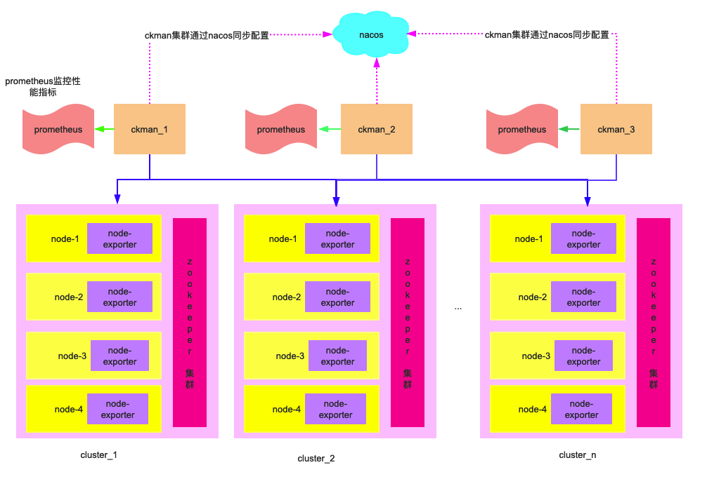
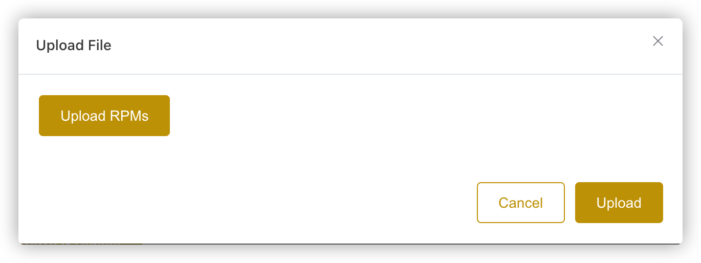
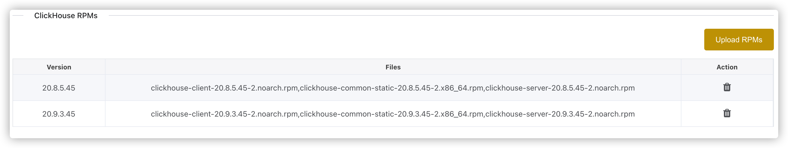
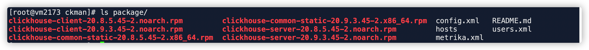
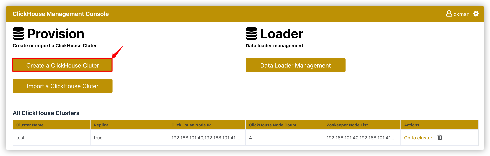
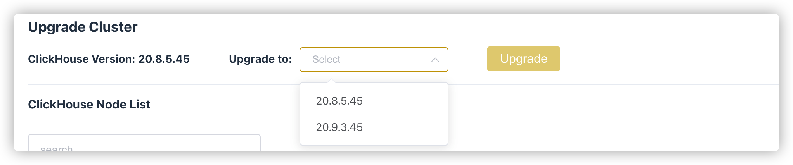
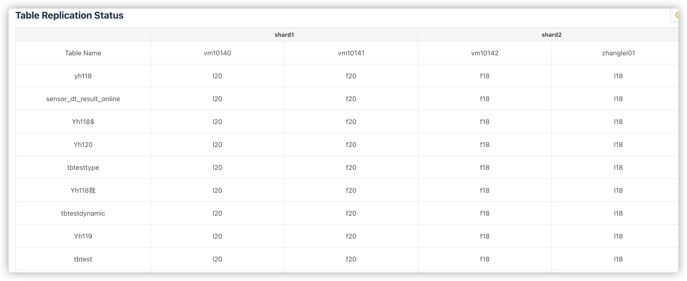

# ckman介绍

`ClickHouse`作为`OLAP`场景特别优秀的数据库解决方案，写入速度快，查询性能强，尤其是聚合查询能力特别出色，已在腾讯、哔哩哔哩、快手等公司得到有效实践。与此同时，`ClickHouse`在集群部署时配置复杂，流程繁琐也困扰着广大使用者。在此背景之下，`ckman`应运而生。

`ckman`（`ClickHouse Manager`）是由擎创信息科技公司自主研发的一款管理`ClickHouse`的工具。它主要用来管理`ClickHouse`集群、节点以及数据监控等，致力于服务`ClickHouse`分布式的操作以及管理。同时提供简单的数据查询窗口。

通过网页端的可视化界面，`ckman`可以非常便捷的完成集群的导入、部署、节点的增删以及性能指标的监控等功能，可以大大简化集群部署的操作流程，从而起到事半功倍的效果。

如今，这款工具已经在`github`上开源啦！有想要体验的同学可以移步 https://github.com/housepower/ckman ，欢迎`star`和`issue`。


# ckman架构

  

ckman支持多中心部署，使用nacos进行配置同步，可以对多个集群进行管理，在集群的每个节点下，如果配置node_exporter，则可以对对应的节点进行指标监控。node_exporter的数据传给prometheus，然后在前端展示。

# ckman编译

## Linux & MacOS下编译

### 编译命令

`ckman`依赖`golang`(推荐`1.17`)，需要提前安装好, `Linux`和`MacOS`下编译命令都是一样的：

```bash
make package VERSION=x.x.x   
```

以上命令会编译成打包成一个`tar.gz`安装包，该安装包解压即可用。

`VERSION`是指定的版本号，如果不指定，则默认取`git describe --tags --dirty`的结果作为版本号。

### rpm编译

```bash
make rpm VERSION=x.x.x
```

### deb编译

```bash
make deb VERSION=x.x.x
```

## Docker编译

鉴于编译环境的诸多依赖，配置起来可能比较麻烦，因此也提供了`docker`编译的方式，直接运行下面的命令即可：

```bash
make docker-build VERSION=x.x.x
```

如果想利用`docker`编译`rpm`版本，可以先进入`docker`环境，再编译：

```bash
make docker-sh
make rpm VERSION=x.x.x
```

# ckman安装部署
详见安装[教程](./guide/deploy.md)。

## ckman配置文件

`ckman`的配置文件在`ckman` 的工作目录下的`conf/ckman.yml`。

| 一级选项     | 二级选项          | 默认值                             | 说明                                                         |
| ------------ | ----------------- | ---------------------------------- | ------------------------------------------------------------ |
| `server`     | `id`              | `1`                                | `ckman`集群`id`，同一个集群的`ckman`的`id`号配置必须不同     |
|              | `port`            | `8808`                             | `ckman`默认的监听端口                                        |
|              | `https`           | `false`                            | 是否监听`https`，默认为不监听                                |
|              | `certfile`        |                                    | `https`的证书文件，如果开启了`https`， 默认使用`conf`下的`server.crt` |
|              | `keyfile`         |                                    | `https`的`key`文件， ，如果开启了`https`， 默认使用`conf`下的`server.key` |
|              | `pprof`           | `true`                             | 是否支持`pprof`监控，默认支持                                |
|              | `session_timeout` | `3600`                             | 会话超时（`token`失效）时间，默认为`1`个小时                 |
|              | `publick_key`     |                                    | 接入擎创统一门户用来解析`token`的公钥                        |
|              | `swagger_enable`  | `false`                            | 是否开启`swagger`文档，默认不开启                            |
| `log`        | `level`           | `INFO`                             | 日志级别，默认为`INFO`                                       |
|              | `max_count`       | `5`                                | 滚动日志数量                                                 |
|              | `max_size`        | `10`                               | 单个日志大小，默认为`10M`                                    |
|              | `max_age`         | `10`                               | 日志有效生命周期，默认为`10`天                               |
| `prometheus` | `hosts`           | `127.0.0.1:9090`                   | 普罗米修斯监控的`ip`和端口                                   |
|              | `timeout`         | `10`                               | 普罗米修斯的超时时间                                         |
| `nacos`      | `enabled`         | `true`                             | 是否开启`nacos`，默认为`true`                                |
|              | `hosts`           | `127.0.0.1`                        | `nacos`服务的`ip`                                            |
|              | `port`            | `8848`                             | `nacos`服务的端口                                            |
|              | `user_name`       | `nacos`                            | 登录`nacos`的用户名                                          |
|              | `password`        | `0192023A7BBD73250516F069DF18B500` | 登录`nacos`的密码                                            |
|              | `namespace`       |                                    | 指定`nacos`的`namespace`，默认为`DEFAULT`                    |
|              | `group`           | `DEFAULT_GROUP`                    | 向`nacos`注册的服务所处的组                                  |
|              | `data_id`         | `ckman`                            | 向`nacos`注册的服务名称、数据项名称                          |

# ckman功能说明

## ckman 支持的接口

详细接口参数可通过`swagger`文档查看。

`swagger`访问方式：开启`ckman`服务后，通过[http://127.0.0.1:8808/swagger/index.html](http://127.0.0.1:8808/swagger/index.html) 网址访问。

| 接口                                        | method   | 说明                         |
| ------------------------------------------- | -------- | ---------------------------- |
| `/api/login`                                | `POST`   | 登录                         |
| `/api/logout `                              | `PUT`    | 退出登录                     |
| `/api/v1/ck/cluster`                        | `GET`    | 获取所有集群信息             |
| `/api/v1/ck/cluster`                        | `PUT`    | 更新集群信息                 |
| `/api/v1/ck/cluster`                        | `POST`   | 导入集群                     |
| `/api/v1/ck/cluster/{clusterName}`          | `GET`    | 获取指定集群的信息           |
| `/api/v1/ck/cluster/{clusterName}`          | `DELETE` | 删除集群                     |
| `/api/v1/ck/destroy/{clusterName}`          | `PUT`    | 销毁集群                     |
| `/api/v1/ck/get/{clusterName}`              | `GET`    | 获取指定集群的信息           |
| `/api/v1/ck/node/{clusterName}`             | `POST`   | 增加节点                     |
| `/api/v1/ck/node/{clusterName}`             | `DELETE` | 删除节点                     |
| `/api/v1/ck/open_sessions/{clusterName}`    | `GET`    | 获取有效`session`个数        |
| `/api/v1/ck/query/{clusterName}`            | `GET`    | 执行`Query`                  |
| `/api/v1/ck/rebalance/{clusterName}`        | `PUT`    | `Rebalance`集群数据          |
| `/api/v1/ck/slow_sessions/{clusterName}`    | `GET`    | 获取慢`SQL`查询              |
| `/api/v1/ck/start/{clusterName}`            | `PUT`    | 启动集群                     |
| `/api/v1/ck/stop/{clusterName}`             | `PUT`    | 停止集群                     |
| `/api/v1/ck/table/{clusterName}`            | `GET`    | 描述表                       |
| `/api/v1/ck/table/{clusterName}`            | `PUT`    | 更新表                       |
| `/api/v1/ck/table/{clusterName}`            | `POST`   | 创建表                       |
| `/api/v1/ck/table/{clusterName}`            | `DELETE` | 删除表                       |
| `/api/v1/ck/table_metric/{clusterName}`     | `GET`    | 获取表集群信息               |
| `/api/v1/ck/upgrade/{clusterName}`          | `PUT`    | 升级集群                     |
| `/api/v1/config`                            | `GET`    | 获取配置                     |
| `/api/v1/config`                            | `PUT`    | 修改配置                     |
| `/api/v1/deploy/ck`                         | `POST`   | 部署`ck`                     |
| `/api/v1/metric/query`                      | `GET`    | 获取`query`指标              |
| `/api/v1/metric/query_range`                | `GET`    | 获取范围指标                 |
| `/api/v1/package`                           | `GET`    | 获取安装包列表               |
| `/api/v1/package`                           | `POST`   | 上传安装包                   |
| `/api/v1/package`                           | `DELETE` | 删除安装包                   |
| `/api/v1/zk/replicated_table/{clusterName}` | `GET`    | 获取复制表状态               |
| `/api/v1/zk/status/{clusterName}`           | `GET`    | 获取集群状态                 |
| `/api/v1/ck/ping/{clusterName}`             | `POST`   | 监测集群节点连通性           |
| `/api/v1/ck/purge_tables/{clusterName}`     | `POST`   | 删除指定范围内的数据         |
| `/api/v1/ck/archive/{clusterName}`          | `POST`   | 归档指定时间范围数据到`HDFS` |

## 登录

`ckman`默认的登录名为`ckman`， 密码为` Ckman123456!`

>   **注意：** `Ckman123456!`是默认的密码，该密码可以通过`ckmanpassword`工具进行修改。修改方式和`ckman`的安装方式有关：
>
>   如果是`tar.gz`解压安装，则需要进入到`bin`目录下，在该目录下执行：
>
>   ```bash
>   ./ckmanpassword
>   ```
>
>   如果是通过`rpm`方式安装，则需要`cd`到`/etc/ckman/conf`目录下，执行:
>
>   ```bash
>   cd /etc/ckman/conf
>   ckmanpassword
>   ```
>
>   执行完成后，在`conf`目录下会生成一个新的`password`文件，覆盖掉原来的`password`，这样就可以使用新的密码登录了。

登陆成功后会得到一个`token`，该`token`在1个小时内有效(如果不做任何操作的话)，`token`失效后需要重新登录。

登陆成功后会进入如下所示的主页：


在主页上，除了有创建集群和导入集群等操作按钮外，还有集群展示的列表。

这个集群列表是通过`ckman`工作目录下`conf/clusters.json`文件导入进来的。主要展示集群名、是否支持副本、节点ip、节点数量、zk节点等信息。

重点说下`clusters.json`这个文件。

如下所示，为一个`clusters.json` 的示例文件。

```json
{
    "@ck_cluster_config_version": "配置版本，如果配置了多中心部署，会从nacos上同步集群配置，版本号大的会覆盖版本号小的",
    "ck_cluster_config_version": 5,
    "@test":"test是集群名称，它是以一个map的形式存储的",
    "test": {		
    "@mode":"集群的模式，import表示是导入的集群，还有deploy，表示是通过部署的，import的集群只能查看，不能操作，deploy的集群可以查看和操作",
    "mode": "import",	
    "@hosts":"ck节点ip列表",
    "hosts": [	
      "192.168.0.1",
      "192.168.0.2",
      "192.168.0.3",
      "192.168.0.4"
    ],    
    "@port": "ck节点的TCP端口",
    "port": 9000,
    "@httpPort": "ck节点的HTTP端口",
    "httpPort": 8123,
    "@user":"ck用户",
    "user": "eoi",   
    "@password": "ck密码",
    "password": "123456",   
    "@cluster": "集群的名字",
    "cluster": "test",  
    "@zkNodes": "zk集群的ip列表",
    "zkNodes": [       
      "192.168.101.40",
      "192.168.101.41",
      "192.168.101.42"
    ],
    "@zkPort":"zk的端口",
    "zkPort": 2181,	
    "@zkStatusPort": "zookeeper的监控端口",
    "zkStatusPort": 8080,
    "@isReplica": "是否支持副本",
    "isReplica": true,  
    "@version": "ck版本",
    "version": "20.8.5.45",  
    "@sshUser": "ssh连接节点主机的用户名，如果是import的集群，此处为空",
    "sshUser": "",      
    "@sshPassword": "ssh连接节点主机的密码",
    "sshPassword": "", 
    "@sshPort":"ssh 端口，默认为22",
    "sshPort":22,
    "@shards": "分片信息，以下表示2分片2副本",
    "shards": [			
      {
        "@replicas": "副本信息，包含ip和hostname",
        "replicas": [  
          {
            "ip": "192.168.0.1",
            "hostname": "node1"
          },
          {
            "ip": "192.168.0.2",
            "hostname": "node2"
          }
        ]
      },
      {
        "replicas": [
          {
            "ip": "192.168.0.3",
            "hostname": "node3"
          },
          {
            "ip": "192.168.0.4",
            "hostname": "node4"
          }
        ]
      }
    ],
	"@path": "存放数据的路径，如果是import的集群，为空",
    "path": ""    
  }
}
```

每次对集群进行操作（增加、删除、修改、`rebalance`等），都会修改`clusters.json`这个文件，相应的`ck_cluster_config_version`都会发生变化。

## 安装包管理

在主页上点击设置按钮，进入如下的页面：


点击`Upload RPMs`，出现如下界面。



注意安装包上传时需要三个安装包都上传（`server`、`client`、`common`），上传成功后，在安装包列表下会显示新上传的记录：



>   注意：如果上传的安装包有缺失（比如少了`common`），安装包仍然能上传成功，但不会显示在列表上。

上传成功的安装包其实位于`ckman`工作目录的`package`目录下：



点击删除按钮，则会删除掉对应版本的安装包。

此处的安装包主要用来部署`ck`集群、节点部署`ck`以及升级`ck`集群的时候使用。

## 集群管理

### 创建集群

点击主页的` Create a ClickHouse Cluster`，就会进入创建集群的界面：



需要填写的项主要有以下：

>   -   `ClickHouse Version`: `ck`的版本，不需要自己填写，通过下拉列表选择，下拉列表中会列出`ckman`服务器中所有的安装包版本。
>       -   此处版本信息只会列出当前`ckman`服务下的安装包版本，如果配置了多中心，其他`ckman`的安装包是无法看见的
>       -   由`version`的来源可知，在部署集群之前，需要先上传安装包。部署的集群版本时基于上传安装包的版本的。
>   -   `Cluster Name`： 集群的名字，注意不要和已有的名字重合
>   -   `ClickHouse TCP Port`: `clickhouse`的`TCP`端口，默认是`9000`，当然也可以自己指定
>   -   `ClickHouse Node List`: `clickhouse`节点列表，以逗号分隔
>   -   `Replica`： 是否开启副本，默认是关闭
>       -   如果开启了副本，默认是1个`shard`一个副本，所以节点数量一定要是偶数，否则会报错
>       -   如果要增加节点的副本数，可通过增加节点完成，创建集群时最多只能指定一个副本
>       -   如果没有开启副本，则有几个节点就有几个`shard`
>       -   注意：集群是否支持副本在部署集群时就已经决定了，后续不可更改
>   -   `Zookeeper Node List`: `zk`列表
>       -   `ckman`并没有提供`zookeeper`集群搭建的功能，因此在部署集群之前，需要将`zookeeper`集群搭建好。
>   -   `ZooKeeper Port`: `zk`端口，默认是`2181`
>   -   `ZK Status Port`: `zookeeper`指标监控的端口，默认`8080` 
>       -   该功能是`zookeeper v3.5.0`以上版本开始支持的，如果`zk`版本太旧，无法从界面看到`zk`的指标
>   -   `Data path`: `ck`节点数据存放的路径
>   -   `Cluster Username`: `ck`的用户名
>       -   注意：`default`用户作为保留用户，此处不能填`default`。
>   -   `Cluster Password`: `ck`的密码
>   -   `SSH Username`: `ssh`登录`ck`节点的用户名
>       -   该用户必须具有`root`权限或是`root`本身，否则部署无法成功，一般都是`root`。
>   -   `SSH Password`: `ssh`登录`ck`节点的密码
>   -   `SSH Port`: `ssh`端口，默认是`22`

通过此种方式安装部署成功的集群的`mode`就是`deploy`，可以对其进行删、改、`rebalance`、启停、升级以及节点的增删等操作。

***需要注意的是：当前版本的ckman仅支持在centos7以上的系统部署ck。***

### 导入集群

点击主页的 `Import a ClickHouse Cluster`按钮，会进去导入集群界面。


需要填写的信息如下所示：

>   `Cluster Name`: 节点名称，该名称必须是确实存在的集群名，且不能与`ckman`中已有的集群名字重复。
>
>   `ClickHouse Node IP`: `clickhouse`节点`ip`列表，以逗号分隔
>
>   `ClickHouse TCP Port`: `ck`节点`TCP`端口，默认为`9000`
>
>   `Zookeeper Node List`: `zk`节点列表
>
>   `ZooKeeper Port`: `zk`端口，默认为`2181`
>
>   `ZK Status Port`: `zookeeper`指标监控的端口，默认`8080` 
>
>   `Cluster Username`: `ck`的用户名
>
>   `Cluster Password`: `ck`的密码

导入集群有个前提是该集群必须确实存在，否则导入会出现问题。

导入的集群的`mode`为`import`，这种模式的集群不能进行修改、`rebalance`、启停、升级以及节点的增删等操作（因为这些操作都需要提供`root`用户权限，但是导入的集群没有提供这些信息），但是可以删除和查看。

### 管理节点

从首页点击 `Go to cluster`,进入集群的管理界面。


主要有`Overview`、`Manage`、`Tables`、`Session`、`Query Execution`、`Settings`等选项，点击`Manage`按钮，进入下面的页面：


右上角的操作：`Start Cluster`、`Stop Cluster`、`Destroy Cluster`以及`rebalance Cluster`针对的是`deploy`模式的集群，`import`的集群均不可操作。

以下这些过程都是`ckman`自己完成的，用户无需手动干涉。

>   -   `Start Cluster`: 启动集群
>       -   先检查节点是否正常工作，找到已停止服务的节点，`ssh`到每台已停止服务的`ck`节点下启动`clickhouse`服务，都成功才返回成功
>   -   `Stop Cluster`
>       -   `ssh`到每台`ck`节点下关闭`clickhouse`服务，都成功才返回成功
>   -   `Destroy Cluster`
>       -   首先第一步停止正在运行的`clickhouse`服务
>       -   然后卸载`clickhouse`软件
>       -   删除`cluster.json`并同步到`nacos`
>       -   销毁集群与删除集群的区别：
>           -   销毁集群后集群彻底不存在了
>           -   删除集群只是删除`ckman`中集群管理的入口（`cluster.json`），集群还存在，可以重新导入
>   -   `Rebalance Cluster`
>       -   一般情况下，通过`clickhouse-sinker`插入的数据基本上是均衡分布在各个节点的。但是如果新增了一个节点，那么新增的节点数据一定是空的，这时候可以通过`rebalance`工具进行数据搬运
>       -   `rebalance`搬运数据是直接将某个分区的数据直接搬运到目标节点，在搬运的过程中如果有查询操作，正在搬运的这部分数据是无法查到的，因此在进行`rebalance`操作时，请避免查询操作（`rebalance`操作时间很短，一般不会影响业务）
>       -   **需要注意的是，如果集群是开启了副本模式，`Rebalance`是通过`attach`和`detach`分区文件的方式进行数据迁移的；如果集群不是副本模式，则通过ssh进行操作，这时就需要集群各个节点之间建立互信。**

#### 升级集群

如果上传了新版本的安装包，可以从`Upgrade Cluster`下拉列表中选择新版本，点击`Upgrade`即可进行升级。



#### 增加节点


增加节点需要填写：

>-   `New Node IP`: 新节点的`IP`
>-   `Node Shard`: 节点的`Shard NUmber`。
>   -   如果填写的`shard`是已经存在的，那么增加的节点会作为已存在`shard`的一个副本；如果`shard`不存在（一般是最大的`shard`编号`+1`，如果不是就不正确了），就会新增加一个`shard`。
>-   如果集群不支持副本模式，则每个`shard`只能有一个节点，不可以给已有`shard`添加副本节点，如果集群支持副本模式，则可以在任意`shard`增加节点。

以上完成后，会将新节点的信息刷到集群所有节点的`metrika.xml`中。

#### 删除节点

删除节点时需要注意的是：删除节点并不会销毁该节点，只会停止该节点的`clickhouse`服务，并从`cluster.json`中删除掉。

删除节点时，如果某个`shard`有且只有一个节点，那么这个节点一般是不可以被删除的，除非该节点处于`shard`编号的最大位置。

同增加节点一样，删除节点`ckman`也会将最新的`metrika.xml`刷新到所有节点。

## 监控管理

### 集群监控

点击`Overview`就进入到集群监控页面，如下图所示：


#### **ClickHouse Table KPIs**

| 指标               | 说明                                                         |
| ------------------ | ------------------------------------------------------------ |
| `clickhouse.Query` | 针对`Clickhouse`集群的分布式表发起的查询，按照发起时刻的分布图 |

#### ClickHouse Node KPIs

| 指标           | 说明          |
| -------------- | ------------- |
| `cpu usage`    | `CPU`占用情况 |
| `memory usage` | 内存占用情况  |
| `disk usage`   | 硬盘占用情况  |
| `IOPS`         | `IO`指标      |

#### **ZooKeeper KPIs**

`zookeeper`监控使用的是`zookeeper-3.5.0`版本新增的特性，通过暴露的`8080`端口监控`mntr`指标信息，因此，如果想要看到`zookeeper`的监控指标，需要保证当前使用的`zookeeper`版本大于等于`3.5.0`。

| 指标                              | 说明                 |
| --------------------------------- | -------------------- |
| `znode_count`                     | `znode`数            |
| `leader_uptime`                   | `leader`存活时间     |
| `stale_sessions_expired`          | 过期的会话           |
| `jvm_gc_collection_seconds_count` | `jvm` `gc`的次数     |
| `jvm_gc_collection_seconds_sum`   | `jvm` `gc`花费的时间 |

## 表管理

表管理主要分为`Table Metrics`、`Table Replication Status`、以及`Zookeeper Status`。

### Table Metrics

统计表的一些指标。除`system`数据库的表之外，其他数据库的表都会显示在下面。


`Queries Cost`有三个值：

-   `0.5`：过去7天`50% SQL`的平均耗时
-   `0.99`：过去7天`99% SQL`的平均耗时
-   `max`：过去7天 `SQL`最大耗时

### Table Replication Status

统计复制表的一些状态。



此处会统计每个`shard`下每张表的各副本之间的统计量。

理论上每个`shard`内副本之间各表的统计都应该相等的，如果有不相等，就说明有节点落后了，这时候落后的节点会标黄。如果某个副本上所有的表都落后，说明这个副本可能出问题了。

### Zookeeper Status

`zookeeper`的相关指标查看。

可查看的指标包括：版本，主从状态，平均延迟，近似数据总和大小，`znode`数等。


## 会话管理

### Open Sessions

显示当前正在进行的会话。


### Slow Sessions

显示`7`天内最慢的`10`条`SQL`语句。

包含`SQL`的执行时间、`SQL`耗时、`SQL`语句、`ck`用户、`query id`、查询的`IP`以及线程号。


## Query管理

`ckman`还提供了简单的`clickhouse`查询的页面。通过该页面可以查询集群中的数据。


>   注意：
>
>   该工具只能查询，不能进行`mutation`的相关操作。
>
>   该工具主要针对分布式表，本地表也能查，但是如果本地表在集群的其他节点不存在，就会报错。即使表在所有节点都存在，查询出来的数据也是某个节点的数据，因此每次查询出来的数据可能不一致。

## Settings


-   `HA Pair Addresses`：多中心部署`ckman`的节点列表
-   `Prometheus Addresses`: 普罗米修斯配置地址
-   `Alert Manager Addresses`： 告警管理地址

配置完成后，点击`Save & Reboot`，会将这些配置信息重新写入到配置文件，并重启`ckman`。

# 命令行工具

`ckman`除了上面的网络端界面以外，还提供了一些命令行工具：

## exporter

导出指定时间范围的数据到`HDFS`。

如：

```bash
exporter --ch-hosts=192.168.0.1,192.168.0.2 --ch-user=eoi --ch-password=123456 --ch-tables=dbtest,tbtesttype --hdfs-addr=localhost:8020 --hdfs-dir=/data
```

参数说明：

>   -   `v`
>       -   查看版本号
>   -   `ch-hosts`
>       -   `clickhouse`节点列表（每`shard`仅列出一个）
>   -   `ch-port`
>       -   `clickhouse` `tcp` 端口号，默认`9000`
>   -   `ch-user`
>       -   `clickhouse` 用户
>   -   `ch-password`
>       -   `clickhouse` 密码
>   -   `ch-database`
>       -   `clickhouse` 数据库，默认`default`
>   -   `ch-tables`
>       -   表名列表
>   -   `dt-begin`
>       -   开始时间，默认`1970-01-01`（包含）
>   -   `dt-end`
>       -   结束时间（不包含）
>   -   `max-file-size`
>       -   文件最大大小限制，默认`10G`
>   -   `hdfs-addr`
>       -   `hdfs`的`ip:port`
>   -   `hdfs-user`
>       -   `hdfs`的用户
>   -   `hdfs-dir`
>       -   `hdfs`的文件路径

以上命令会在`HDFS`中，指定的`hdfs-dir`下，以表名作为目录，生成形如`host_slot.parquet`格式的文件。

时间范围包含`begin`，不包含`end`。

## purger

删除指定时间范围的数据。直接`drop` 分区数据。

如：

```bash
purger --ch-hosts=192.168.0.1,192.168.0.2 --ch-port=9000 --ch-user=eoi --ch_password=123456 --ch-database=default --ch-tables=dbtest --dt-begin=2021-02-01 --dt-end=2021-02-28
```

参数说明：

>   -   `v`
>       -   查看版本号
>   -   `ch-hosts`
>       -   `clickhouse`节点列表（每`shard`仅列出一个）
>   -   `ch-port`
>       -   `clickhouse` `tcp` 端口号，默认`9000`
>   -   `ch-user`
>       -   `clickhouse` 用户
>   -   `ch-password`
>       -   `clickhouse` 密码
>   -   `ch-database`
>       -   `clickhouse` 数据库，默认`default`
>   -   `ch-tables`
>       -   表名列表
>   -   `dt-begin`
>       -   开始时间，默认`1970-01-01`（包含）
>   -   `dt-end`
>       -   结束时间（不包含）

## schemer

在指定结点创建与另一指定结点相同的表格。

通过该工具，会在目标节点上创建于源节点除`system`数据库以外的所有数据库和表。如：

```bash
schemer --src-host=192.168.0.1 --dst-host=192.168.0.2 --ch-port=9000 --ch-user=eoi --ch-password=123456
```

参数说明：

>   -   `v`
>       -   显示版本信息
>   -   `src-host`
>       -   源节点
>   -   `dst-host`
>       -   目标节点
>   -   `ch-port`
>       -   `tcp`端口号，默认`9000`
>   -   `ch-user`
>       -   目标节点`ck`用户
>   -   `ch-password`
>       -   目标节点`ck`密码

## rebalancer

集群结点间负载均衡。

此处的均衡操作直接是物理搬运，先通过一套均衡规则计算出需要从哪些节点移除，添加到哪些节点，然后将源节点的分区`detach`掉，然后通过`ssh`将分区数据传输给目标节点，`attach`到目标节点上，并删除掉源节点的分区数据。

`ckman`的`rebalance`也是使用此工具完成的负载均衡。在搬运某表数据期间，针对该表的查询将可能得到不一致的结果。

参数说明：

>   -   `v`
>       -   显示版本信息
>   -   `ch-hosts`
>       -   `ck`节点列表
>   -   `ch-port`
>       -   `ck`节点`tcp`端口，默认`9000`
>   -   `ch-user`
>       -   `ck`用户名
>   -   `ch-password`
>       -   `ck`密码
>   -   `ch-database`
>       -   `ck`数据库，默认`default`
>   -   `ch-data-dir`
>       -   数据存放目录
>   -   `os-user`
>       -   节点主机用户名(需要有`root`权限)
>   -   `os-password`
>       -   节点主机密码

# 扩展API

除了`ckman`页面上展示的功能外，`ckman`还提供了一些扩展的API，用户可使用`cURL`或`Postman`等工具对这些`API`进行操作，从而完成一些扩展功能。

这些`API`主要有：

## 描述表

>`METHOD`： `GET`
>
>`URL`：         ` /api/v1/ck/table/{clusterName}`

调用 `DESCRIBE TABLE database.table`语句进行查看表的结构信息。使用`tableName`指定表名，`database`指定数据库名。

举例如下：

```bash
GET  http://192.168.0.1:8808/api/v1/ck/table/test?tableName=tbtest&database=default
```

返回结果：

```json
{
    "code": 0,
    "msg": "ok",
    "data": [
        {
            "name": "service",
            "type": "String",
            "defaultType": "",
            "defaultExpression": "",
            "comment": "",
            "codecExpression": "",
            "ttlExpression": ""
        },
        {
            "name": "ip",
            "type": "String",
            "defaultType": "",
            "defaultExpression": "",
            "comment": "",
            "codecExpression": "",
            "ttlExpression": ""
        },
        {
            "name": "metric",
            "type": "String",
            "defaultType": "",
            "defaultExpression": "",
            "comment": "",
            "codecExpression": "",
            "ttlExpression": ""
        },
        {
            "name": "value",
            "type": "Int64",
            "defaultType": "",
            "defaultExpression": "",
            "comment": "",
            "codecExpression": "",
            "ttlExpression": ""
        },
        {
            "name": "timestamp",
            "type": "DateTime",
            "defaultType": "",
            "defaultExpression": "",
            "comment": "",
            "codecExpression": "",
            "ttlExpression": ""
        }
    ]
}
```

>   注意：本操作要求表在集群的各节点存在，包括本地表和`dist_`开头的分布式表。

## 更新表

>   `METHOD`:  `PUT`
>
>   `URL`:          `  /api/v1/ck/table/{clusterName}`

使用`ALTER`语句完成分布式表的更新。

支持的操作包括增加列、修改列、删除列。

修改完成后需要删除分布式表并重建。

举例如下：

> PUT /api/v1/ck/table/test
```json
{
    "@name": "表名",
	"name":"t1",
    "@database": "数据库名",
    "database":"default",    
    "add":[{
        "@name": "在field3后增加一个fieldNew，类型为String",
    	"name":"fieldNew",	
        "type":"String",
        "after":"field3"
	},
	{
        "@name": "在最后增加一个字段fieldLast，类型为Int32",
    	"name":"filedLast",	
        "type":"Int32"
	}],
    "modify":[{
        "@name": "将filed6修改为DateTime类型",
        "name":"field6",	
        "type":"DateTime"
    }],
    "@drop":"删除field8，field9",
    "drop": ["field8", "field9"]	
}
```

>   注意：该操作只能针对集群中各节点的本地表，且表在各个节点存在。对dist_开头的分布式表无法操作。

## 创建表

>   `METHOD`:  `POST`
>
>   `URL`:           ` /api/v1/ck/table/{clusterName}`

创建表默认使用的是`MergeTree`引擎，如果指定了`distinct`为`false`，表示支持去重，使用的引擎为`ReplacingMergeTree`。

> POST /api/v1/ck/table/test
```json
{
	"name": "t1",		
    "database": "default",  
    "fields":[{			
        "name":"id",
        "type":"Int32"
    },{
        "name":"birth",
        "type":"Date"
    },{
        "name":"name",
        "type":"String"
    }],
    "@order": "order by 的字段,可以指定多个",
    "order": ["id"],	
    "partition": "partition by的字段",
    "partition":{
        "@policy": "分区策略， 0- 按天 1-按周 2-按月",
        "policy": 0,
        "name": "birth"
    },
    "distinct": true
}
```

当然，最终的引擎还是要根据集群是否支持副本来决定，一共有以下几种情况：

| distinct | isReplica | engine                      |
| -------- | --------- | --------------------------- |
| `true`   | `true`    | `ReplicatedReplacingMergeTree` |
| `true`   | `false`   | `ReplacingMergeTree`        |
| `false`  | `true`    | `ReplicatedMergeTree`          |
| `false`  | `false`   | `MergeTree`                 |

与此同时，还需要在集群里创建一张`dist_`开头的分布式表。

## 删除表

>    `METHOD`:  `DELETE`
>
>   `URL`:            `/api/v1/ck/table/{clusterName}`

操作和描述表类似，通过`tableName`指定表名，`database`指定数据库名。

举例如下：

```bash
DELETE  http://192.168.0.1:8808/api/v1/ck/table/test?tableName=t1&database=default
```

通过以上操作就能删除掉表`t1`。删除时先删`dist_`开头的分布式表，再删表`t1`。

>   注意：表必须在集群的各个节点存在且不能是`dist_`开头的分布式表。如果该本地表虽然在集群中各节点存在，但没有根据该本地表创建过分布式表，删除依然会报错。这一点需要注意。


# 结语

千里之行，始于足下。`ckman`的功能目前还只是初版，肯定还存着着诸多不足和可以改进的地方，希望大家多提意见，共同提升`ckman`的使用体验。

