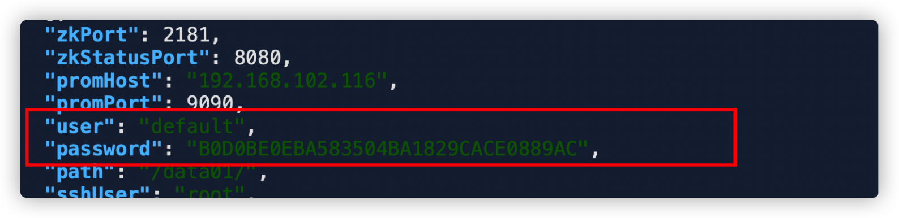
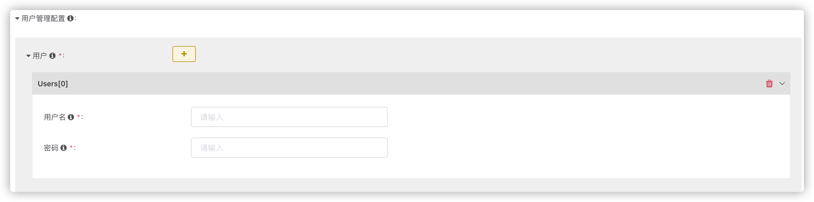
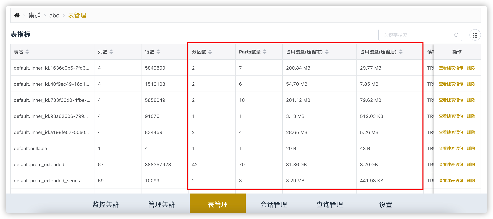
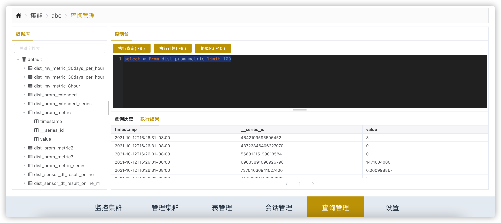
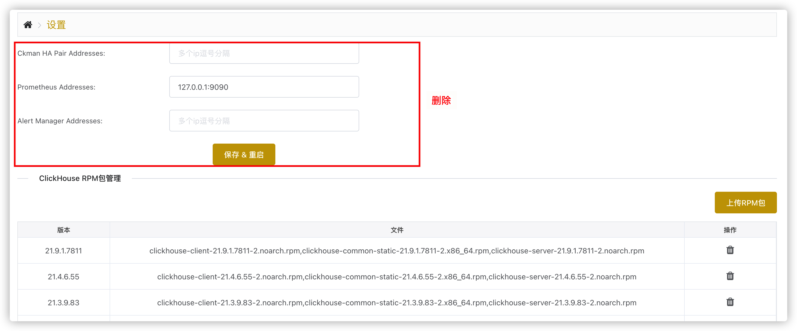
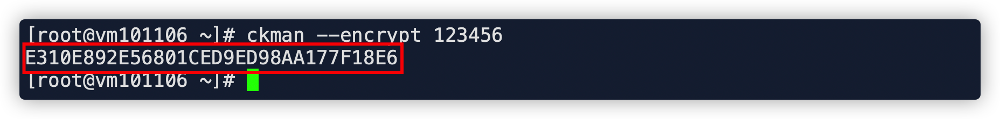

# v2.2.0新版本特性

## 一、用户管理

### 1.1 增加default用户设置密码

事实上，从`clickhouse 21.6`版本以后 ，使用`rpm`包安装`clickhouse-server`的时候，官方就要求用户配置`default`用户的密码。

给`default`用户设置密码能够保证集群的安全，不过需要注意的是，同一个逻辑集群内的多个物理集群，`default`用户的密码必须相同，否则分布式表（逻辑表 ）不能查询。

 

需要注意的是，存放`default`用户的密码的字段，沿用了之前的`user`和`password`字段。因此，使用新版的`ckman`部署集群时，`user`字段自动填充的是`default`，`password`字段则是`default`用户的密码，在后续的`ckman`连接`clickhouse-server`的过程中，将使用`default`用户进行连接操作。



如果使用的是旧的配置文件，则该字段仍然保存的是普通用户，不影响连接使用。不过为了统一，可以手动将普通用户迁移到`Userconf`的配置中去，此处只保留`default`用户的配置。

如果集群是导入的，则`User`字段可以输入任意的用户，可以是`default`，也可以是普通用户，只要能正常连接上集群即可。

### 1.2 增加设置普通用户

增加`UserConf`配置，可设置普通用户，目前只支持用户名和密码的设置，暂不支持权限相关的设置。（将在下个版本支持）

界面如下所示：



可以添加多组普通用户，支持通过设置页面修改用户配置。生成的配置存储在`UserConf`中，并在`clickhouse-server`各节点的`/etc/clickhouse-server/users.d`目录下生成对应的`xml`配置文件，修改立即生效。


## 二、监控管理

### 2.1  每个集群可单独指定 prometheus监控

由于`prometheus`跨数据中心采集会存在带宽的问题，因此在新版本中支持每个集群单独指定`prometheus`的地址 ，移除了`ckman`中配置`prometheus`的设定。这样每个集群的`prometheus`可独立配置，增加灵活性。


### 2.2 修复replica监控相关BUG

上个版本中 ，由于将`replica`宏的值从`hostname`换成 了`ip`，（原因是一旦移除了某个节点，就会将`/etc/hosts`中该节点的`hostname`移除，但是`clickhouse`自身的缓存并不知道，仍然去访问该`hostname`，从而造成访问不到的问题），但是`zookeeper`中`replica`的路径仍然是用的`hostname`，没有同步修改过来，导致删除`shard`中副本节点时，`zookeeper`路径没有同步删除，复制表指标不可监控等，此系`BUG`，在该版本已修复。

### 2.3 表指标监控增加 partition、uncompressed、compressed监控

增加分区数量，压缩前磁盘占用，压缩后磁盘占用的展示。

通过分区数和`parts`数量，可以看到`parts`数量和实际的分区数量的对比（`parts`数量最终会`merge`成分区数量，因此`parts`数忽大忽小属于正常）。

通过压缩前后的磁盘占用，可以看到`clickhouse-server`对数据的压缩比。



## 三、前端界面优化

### 3.1 列表增加筛选排序功能

如图所示，增加了集群列表、节点列表、表指标、复制表指标的全局搜索 及排序功能。


### 3.2 查询页面 优化

如图所示：



注意：`SQL`需选中才能执行。

### 3.3 移除无用设置页面

删除了设置页面无用的设置, 安装包列表默认按照版本号从大到小排列。


移除了无用的设置：



## 四、增加持久化策略

新增了集群配置的持久化策略。这是新版本最大的特性。在旧版本中，所有的集群配置都通过本地的`clusters.json`文件保存 ，同时同步到`nacos`，从而保证`ckman`集群之间的`HA`。

在新版本中，为了支持多中心，考虑到有些业务系统每个中心单独一套`nacos`，因此每个中心之间，`ckman`集群 无法同步配置，因此引入了`MySQL`持久化集群配置，而`nacos`仅作注册中心。

目前持久化策略支持`local`和`mysql`两种。其中`local`仅支持单节点`ckman`使用，是默认的持久化策略。

持久化策略的配置在`server`中的`persistent_policy`：


### 4.1  local存储 

单节点`ckman`默认使用该策略，支持自定义持久化的目录和文件 名、文件格式（支持json和yaml）。

需要在配置文件的`persistent_config`中做如下配置：


如果持久化策略是`local`，且`persistent_config`没有任何配置，则默认使用`conf`下的`clusters.json`作为集群配置文件（为了兼容以前的配置）。

其中：

-   `format`：指持久化到本地的文件格式，支持`json`和`yaml`
-   `config_dir`：持久化到本地的文件路径，需要填写绝对路径，建议放到`ckman`工作目录的`conf`下。
-   `config_file`：持久化到本地的文件名，最终的文件名是该名称加上`format`格式后缀。

`json`配置示例：

```json
{
  "clusters": {
    "shanghai": {
      "version": "21.9.1.7603",
      "cluster": "shanghai",
      "logic_cluster": "bench",
      "port": 9000,
      "isReplica": false,
      "hosts": [
        "192.168.21.73",
        "192.168.21.74"
      ],
      "shards": [
        {
          "replicas": [
            {
              "ip": "192.168.21.73",
              "hostname": "master"
            }
          ]
        },
        {
          "replicas": [
            {
              "ip": "192.168.21.74",
              "hostname": "worker-1"
            }
          ]
        }
      ],
      "zkNodes": [
        "192.168.21.73",
        "192.168.21.74",
        "192.168.21.75"
      ],
      "zkPort": 2181,
      "zkStatusPort": 8080,
      "promHost": "192.168.21.73",
      "promPort": 9090,
      "user": "default",
      "password": "B0D0BE0EBA583504BA1829CACE0889AC",
      "path": "/data01/",
      "sshUser": "root",
      "authenticateType": 0,
      "sshPassword": "E310E892E56801CED9ED98AA177F18E6",
      "sshPort": 22,
      "Storage": null,
      "MergeTreeConf": null,
      "UsersConf": {
        "Users": [
          {
            "Name": "eoi",
            "Password": "E310E892E56801CED9ED98AA177F18E6",
            "Profile": "",
            "Quota": "",
            "Networks": {
              "IPs": null,
              "Hosts": null,
              "HostRegexps": null
            },
            "DbRowPolices": null
          }
        ],
        "Profiles": null,
        "Quotas": null
      },
      "mode": "deploy",
      "httpPort": 8123,
      "zooPath": null
    }
  },
  "logics": {
    "bench": [
      "shanghai"
    ]
  }
}
```

`yaml`配置示例：

```yaml
clusters:
    hefei:
        version: 21.9.1.7603
        cluster: hefei
        logic_cluster: bench
        port: 9000
        isreplica: false
        hosts:
            - 192.168.21.75
        shards:
            - replicas:
                - ip: 192.168.21.75
                  hostname: worker-2
        zknodes:
            - 192.168.21.73
            - 192.168.21.74
            - 192.168.21.75
        zkport: 2181
        zkstatusport: 18080
        promhost: 127.0.0.1
        promport: 9090
        user: default
        password: B0D0BE0EBA583504BA1829CACE0889AC
        path: /data01/
        sshuser: root
        authenticatetype: 0
        sshpassword: E310E892E56801CED9ED98AA177F18E6
        sshport: 22
        storage: null
        mergetreeconf: null
        usersconf:
            users:
                - name: eoi
                  password: E310E892E56801CED9ED98AA177F18E6
                  profile: ""
                  quota: ""
                  networks:
                    ips: []
                    hosts: []
                    hostregexps: []
                  dbrowpolices: []
            profiles: []
            quotas: []
        mode: deploy
        httpport: 8123
        zoopath: {}
    shanghai:
        version: 21.9.1.7603
        cluster: shanghai
        logic_cluster: bench
        port: 9000
        isreplica: false
        hosts:
            - 192.168.21.73
            - 192.168.21.74
        shards:
            - replicas:
                - ip: 192.168.21.73
                  hostname: master
            - replicas:
                - ip: 192.168.21.74
                  hostname: worker-1
        zknodes:
            - 192.168.21.73
            - 192.168.21.74
            - 192.168.21.75
        zkport: 2181
        zkstatusport: 18080
        promhost: 127.0.0.1
        promport: 9090
        user: default
        password: B0D0BE0EBA583504BA1829CACE0889AC
        path: /data01/
        sshuser: root
        authenticatetype: 0
        sshpassword: E310E892E56801CED9ED98AA177F18E6
        sshport: 22
        storage: null
        mergetreeconf: null
        usersconf:
            users:
                - name: eoi
                  password: E310E892E56801CED9ED98AA177F18E6
                  profile: ""
                  quota: ""
                  networks:
                    ips: []
                    hosts: []
                    hostregexps: []
                  dbrowpolices: []
            profiles: []
            quotas: []
        mode: deploy
        httpport: 8123
        zoopath: {}
logics:
    bench:
        - shanghai
        - hefei
```

### 4.2 mysql存储

支持 `ckman`集群(当然也支持单节点)，`ckman`集群通过访问同一个`mysql`数据库 ，从而读到相同的集群配置，达到`ckman`集群之间`HA`的效果。

mysql存储策略需要在配置文件中配置mysql相关的配置：


需要注意的是，配置文件中的密码是加密后的密文，可通过`ckman --encrypt password`得到加密后的密文，如下所示：



将加密后的密文填写到配置文件的密码处即可。

`database`需要提前创建，代表`ckman`使用的数据库。当配置没有问题后，`ckman`服务启动后，会自动创建相关的数据库表。

| 表名          | 说明                                 |
| ------------- | ------------------------------------ |
| `tbl_cluster` | 存放集群配置相关的信息               |
| `tbl_logic`   | 存放逻辑集群与物理集群之间的映射关系 |

###  4.3 migrate 迁移工具

使用该工具，支持各个不同持久化策略之间的迁移，如从`local`的 `json`迁移 到`MySQL`，从`MySQL`迁移到 `local`，`local`的`JSON`格式和 `yaml`格式之间也可相互迁移。

该迁移工具使用之前，需要配置`migrate.yaml`配置文件，默认使用`/etc/ckman/conf/migrate.yaml`。配置选项如下：

```yaml
source: local1	#数据源，从什么地方迁移
target: mysql   #数据目标，迁移到哪里去
persistent_config:  #持久化的配置，source和target的名称一定要能在这里找到
  local1:   #配置名称 
    policy: local  #持久化策略
    config:        #持久化相关的配置
      format: json
      config_dir: /etc/ckman/conf
      config_file: clusters

  local2:
    policy: local
    config:
      format: yaml
      config_dir: /etc/ckman/conf
      config_file: clusters

  mysql:
    policy: mysql
    config:
      host: 127.0.0.1
      port: 3306
      user: root
      password: E310E892E56801CED9ED98AA177F18E6
      database: ckman_db
```

如上面的配置，代表从`local1`迁移到`mysql`，即从`/etc/ckman/clusters.json`中，迁移到`mysql`的`ckman_db`数据库中。

迁移时执行命令如下：

```bash
migrate --config=/etc/ckman/conf/migrate.yaml
```

### 4.4 如何从旧版升级到新版

由于持久化策略发生了比较大的改动，因此，原有的`clusters.json`并不能直接为新版所使用，需要做一些手动的更改：

-   密码的加密方式由`des`改成了`aes`，因此，需要替换掉加密密码。可以先根据明文手动生成加密后的密码(前提是要自己知道密文，可从界面的集群设置中查看)，然后替换到`clusters.json`文件中：


涉及到需要替换的地方有：`sshPassword`， `password`。

-   认证方式，旧版本使用的是`sshPasswdFlag`，新版本改成了`authenticatetype`，因此，需要将该字段名称进行替换。
-   逻辑集群映射字段，旧版本用的是`logic_clusters`，新版本改成了`logics`，该字段需要替换掉。
-   以上完成后，使用`local`的认证方式即可直接使用，或者使用`migrate`迁移工具将其迁移到`mysql`上。

## 五、修复schema相关的问题

### 5.1 同步schema时物化视图造成的BUG

由于本地表、分布式表、物化视图之间有相互依赖关系，因此调整了同步`schema`的顺序，先同步本地表，再同步分布式表 ，再同步物化视图。

### 5.2 新部署集群时，同步逻辑表schema

新部署集群时，如果该集群所属的逻辑集群包含有逻辑表，则会自动同步逻辑集群的本地表、分布式表和逻辑表。

### 5.3 增加删除逻辑表的接口

详见`swagger`文档，略。
