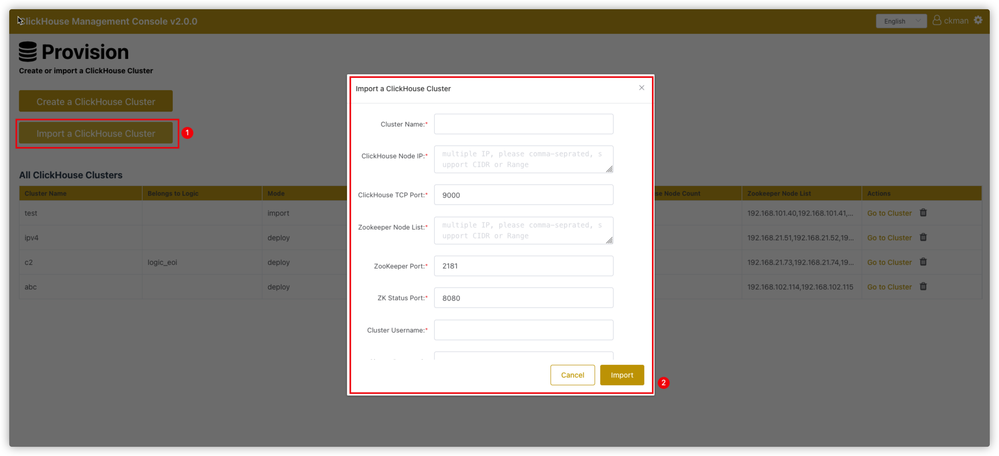
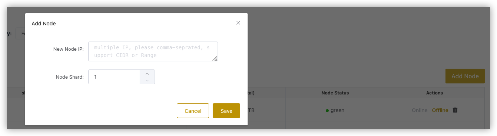
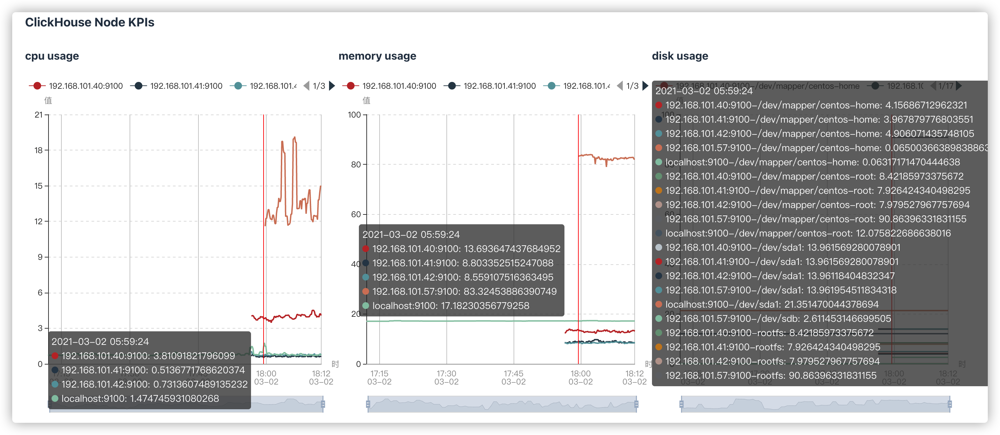
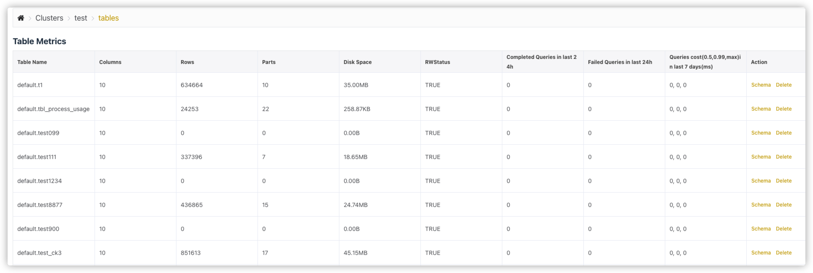
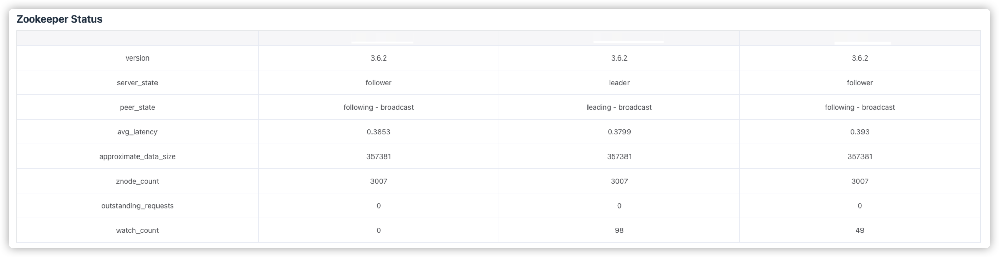
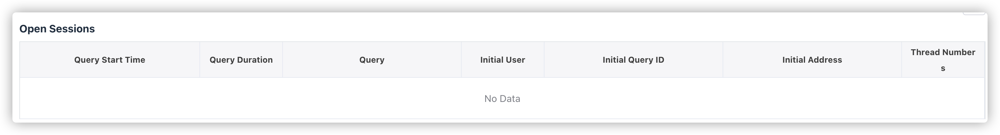
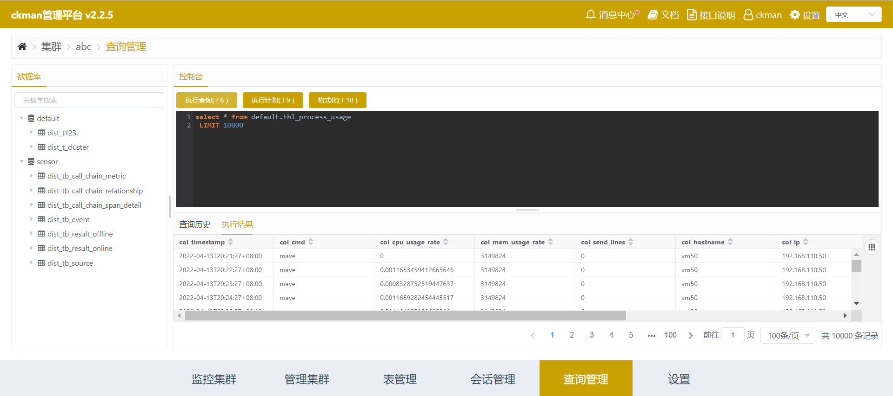

# 导语
>   本文档主要针对使用`ckman`的开发人员、产品经理、架构师，以及任何对`ckman`功能、技术架构感兴趣的同学。通过本文档，可以了解到`ckman`的功能、设计原理，接口规范，以及未来规划等。

# 概述

## 什么是ckman

`ckman`，全称是`ClickHouse Management Console`， 即`ClickHouse`管理平台。它是由擎创科技数据库团队主导研发的一款用来管理和监控`ClickHouse`集群的可视化运维工具。目前该工具已在`github`上开源，开源地址为：[github.com/housepower/ckman](https://github.com/housepower/ckman)。

## 为什么要有ckman

我们不妨思考一下这样的场景：如果要部署一个`ClickHouse`集群，需要怎么做？

首先，我们需要在所有`ClickHouse`节点上安装`ClickHouse`的`rpm`包，然后，需要修改配置文件，包括但不限于`config.xml`、`users.xml`、`metrika.xml`。注意，是所有节点上都要修改，修改完成后需要依次启动各个节点。

当集群规模不大，这些操作手动去完成可能不觉得有什么，但是如果集群规模比较大，单个集群的节点达到了上百台甚至上千台，这时候要手工去每台机器上去操作，显然变得不太现实。

如果需要往集群增加一个节点呢？

我们需要在已有的节点上的`metrika.xml`配置文件中加上该节点，然后在新增节点上安装`rpm`包，修改`metrika.xml`，启动`ClickHouse`服务，最后还要同步其他节点上的`schema`表结构，至此才能完成。

删除节点亦如是。

如果要升级集群呢？我们不仅需要在每个节点上重新安装升级`rpm`包，还需要考虑一些其他的问题：需不需要停服务？如果升级失败了怎么办？

总之，`ClickHouse`的集群运维，如果靠人工去做，不仅繁琐，容易出现各种问题，当集群规模变大后，也变得不切实际。

这时候，`ckman`的出现，就可以完美解决上述的问题。`ckman`将这些运维操作都集成在管理界面中，用户只需要在`web`界面上通过简单的信息配置，点击鼠标，就可以完成所有的配置工作，而无需关注其他细节，也减少了出错的可能。

## ckman能做什么

`ckman`主要的功能是管理和监控`ClickHouse`集群。因此，它的操作对象只能是`ClickHouse`集群，而不是单个`ClickHouse`节点。

### 管理ClickHouse集群

-   部署`ClickHouse`集群
-   导入`ClickHouse`集群
-   升级`ClickHouse`集群
-   增加或删除集群节点
-   对集群（或节点）进行启停
-   实现数据再均衡
-   存储策略配置
-   用户权限配额控制
-   集群配置文件最佳实践及定制化能力 
-   简单`SQL`查询能力

### 监控ClickHouse集群

-   监控`ClickHouse Query`
-   监控节点系统性能指标（`CPU`，`Memory`， `IO`等）
-   监控`Zookeeper`相关指标
-   监控集群分布式表相关指标
-   监控副本状态相关指标
-   监控慢`SQL`等相关指标

## 如何部署ckman

见[ckman部署文档](./deploy.md)。

## 如何使用源码编译ckman

### 编译依赖

由于`ckman`使用`golang`实现，因此需要提前安装`go`(请使用`>=1.17`版本)；

如果需要编译成`rpm`包或`deb`包，需要安装`nfpm`:

```bash
wget -q https://github.com/goreleaser/nfpm/releases/download/v2.15.1/nfpm_2.15.1_Linux_x86_64.tar.gz 
tar -xzvf nfpm_2.15.1_Linux_x86_64.tar.gz 
cp nfpm /usr/local/bin
```

编译前端需要安装`yarn`。在CentOS 7上安装yarn: (参考https://linuxize.com/post/how-to-install-yarn-on-centos-7/)

```
$ curl --silent --location https://dl.yarnpkg.com/rpm/yarn.repo | sudo tee /etc/yum.repos.d/yarn.repo
$ sudo rpm --import https://dl.yarnpkg.com/rpm/pubkey.gpg
$ sudo yum install yarn
$ yarn --version
```

在其他平台上安装`yarn`，请参考[yarn官方文档](https://yarnpkg.com/getting-started/install)。

### 编译命令

####  tar.gz包编译

```bash
make package VERSION=x.x.x   
```

以上命令会编译成打包成一个`tar.gz`安装包，该安装包解压即可用。

`VERSION`是指定的版本号，如果不指定，则默认取`git describe --tags --dirty`的结果作为版本号。

#### rpm包编译

```bash
make rpm VERSION=x.x.x
```

#### docker编译

鉴于编译环境的诸多依赖，配置起来可能比较麻烦，因此也提供了`docker`编译的方式，直接运行下面的命令即可：

```bash
make docker-build VERSION=x.x.x
```

如果想利用`docker`编译`rpm`版本，可以先进入`docker`环境，再编译：

```bash
make docker-sh
make rpm VERSION=x.x.x
```

#### 前端单独编译

为了减少编译上的麻烦，`ckman`代码已经将前端代码编译好，做成静态链接放在`static/dist`目录下，但是仍然将前端代码以`submodule`的形式嵌入在`frontend`目录下，如果想要自己编译前端，在提前安装好前端编译依赖后，可以使用如下命令：

```bash
cd frontend
yarn
cd ..
make frontend
```

# 架构设计


# 配置文件

## server

-   `port`
    -   `ckman`的监听端口
    -   默认为`8808`
-   `https`
    -   是否监听`https`
    -   默认为`false`
-   `certfile`
    -   `https`的证书文件路径，如果开启了`https`，必须要有证书文件
    -    默认使用`conf`下的`server.crt`
    -    注意证书文件的路径`ckman`需要有访问权限
-   `keyfile`
    -   `https`的`key`文件路径，如果开启了`https`，必须要有`key`文件
    -   默认使用`conf`下的`server.key`
    -   注意`key`文件的路径`ckman`需要有访问权限
-   `pprof`
    -   是否支持`pprof`监控
    -   默认为`true`
-   `session_timeout`
    -   会话超时时间，如果超过该时间没有对`ckman`进行任何操作，则`token`失效，需要重新登录
    -   默认超时时间为`3600`秒
-   `public_key`
    -   用来接入`ckman`的公钥
    -   `ckman`可通过`RSA`配置公钥的方式跳过`token`鉴权，只需要在客户端对`header`配置`userToken`，并对`userToken`使用私钥加密，然后在`ckman`服务端使用该公钥进行解密即可。
-   `swagger_enable`
    -   是否开启`swagger`文档
    -   默认不开启
-   `task_interval`
    -   执行异步运维动作的扫描时间间隔
    -   前端请求部署、升级、销毁以及增删节点等比较耗时的操作时，`ckman`先记录状态，然后使用另外的协程异步扫描处理，异步扫描的时间间隔通过该参数可配，默认为`5`秒
-   `persistant_policy`
    -   持久化策略，主要用来存储集群的配置信息，包括集群配置、逻辑集群映射关系 、查询语句历史记录、运维操作状态等。
    -   持久化策略支持`local`、`mysql`和`postgres`
        -   `local`：存储到本地，在`conf`目录下生成一个`clusters.json`文件，不支持集群，为默认配置
        -   `mysql`：持久化到`mysql`，支持`ckman`集群，支持`HA`，需要提前创建数据库，数据库编码为`UTF-8`，不需要创建表，`ckman`会自动创建数据库表 
        -   `postgres`：持久化到`postgres`，支持`ckman`集群，支持`HA`，需要提前创建数据库，并且需要提前创建数据库表。建表语句内置在`dbscript/postgres.sql`中。
        -   除`local`策略外，其他持久化策略都依赖`persistent_config`中的配置项，当然`local`也可以配置该项。

示例如下：

```yaml
server:
  id: 1
  port: 8808
  https: false
  #certfile:
  #keyfile:
  pprof: true
  swagger_enable: true
  session_timeout: 3600
  # support local, mysql, postgres
  persistent_policy: local
  task_interval: 5
  #public_key:
```

## log

-   `level`
    -   日志打印级别
    -   默认为`INFO`
    -   支持 `DEBUG`、`INFO`、`WARN`、`ERROR`、`PANIC`、`FATAL`
-   `max_count`
    -   滚动日志数量
    -   默认为`5`个
-   `max_age`
    -   日志生命有效期
    -   默认为`10`天

示例如下：

```yaml
log:
  level: INFO
  max_count: 5
  # megabyte
  max_size: 10
  # day
  max_age: 10
```

## cron

定时任务相关的配置。支持`cron`表达式，格式为：`Second | Minute | Hour | Dom | Month | Dow | Descriptor`

-   `sync_logic_schema`
    -   同步逻辑表的`schema `定时任务，  默认为`1`分钟一次。

## persistent_config

### mysql & postgres

`mysql`和`postgres`配置项基本一致，主要涉及以下配置项：

-   `host`

    -   连接数据库的`ip`地址

-   `port`

    -   连接数据库的端口号，如`mysql`默认为`3306`，`postgres`默认为`5432`

-   `user`

    -   连接数据库的用户

-   `password`

    -   连接数据库的密码，可选择是否加密，如果需要加密，可使用下面命令获得密码的密文 。

        ```bash
        ckman --encrypt 123456 
        E310E892E56801CED9ED98AA177F18E6
        ```

    -   如果数据库密码选择加密，请使用`ENC()`将密文包含起来，如：

    ```yaml
    password: ENC(E310E892E56801CED9ED98AA177F18E6)
    ```

-   `database`

    -   需要连接的数据库，需提前创建，并且保证编码为`UTF-8`

### local

-   `format`
    -   本地文件格式，支持`JSON`和`yaml`，默认为`json`
-   `config_dir`
    -   本地文件的目录，需要填写路径，默认为`ckman`工作路径的`conf`目录下
-   `config_file`
    -   本地文件的文件名，默认为`clusters`

## nacos

-   `enabled`
    -   是否开启`nacos`
    -   默认为不开启
-   `hosts`
    -   `nacos`服务的`ip`地址
    -   可以配置多组
-   `port`
    -   `nacos`服务的端口
-   `user_name`
    -   登录`nacos`的用户名
-   `password`
    -   登录`nacos`的密码，加密规则同持久化策略数据库密码，同样，如果需要加密，需要以`ENC()`将密文包含起来。
-   `namespace`
    -   指定`nacos`的`namespace`，默认为`DEFAULT`
-   `group`
    -   向`nacos`注册的服务所在的组
    -    默认为`DEFAULT_GROUP`
-   `data_id`
    -   向`nacos`注册服务名称、数据项名称
    -   默认为`ckman`

示例如下：

```yaml
nacos:
  enabled: false
  hosts:
    - 127.0.0.1
  port: 8848
  user_name: nacos
  password: 0192023A7BBD73250516F069DF18B500
  #namespace:
  #group:
  #data_id:
```


# 功能介绍

## 集群管理

### 部署集群

点击主页的` Create a ClickHouse Cluster`，就会进入创建集群的界面：


需要填写的项主要有以下：

>   -   `Cluster Name`： 集群的名字，注意不要和`ckman`已有的名字重合
>   -   `Package Type`: 安装包类型，用来区分平台和架构，不需要自己填写，上传安装包后可通过下拉框选择。
>       -   如果选择的平台和架构不正确，如在`arm`的机器上部署`x86`的安装包，则不会成功。
>   -   `ClickHouse Version`: `ck`的版本，不需要自己填写，通过下拉列表选择，下拉列表中会列出`ckman`服务器中所有的安装包版本。
>       -   此处版本信息只会列出当前`ckman`服务下的安装包版本，如果配置了多中心，其他`ckman`的安装包是无法看见的
>       -   在部署集群之前，需要先上传安装包。部署的集群版本是基于上传安装包的版本的。
>   -   `Logic Name`：逻辑集群名字，可以指定，也可以不指定
>   -   `TCP Port`: `clickhouse`的`TCP`端口，默认是`9000`，当然也可以自己指定
>   -   `ClickHouse Node List`: `clickhouse`节点列表，支持简写
>
>   >   **对于`clickhouse`节点机器，推荐配置如下：**
>   >
>   >   - 所有`HDD`做一个大的`RAID 5`阵列
>   >   - 用`hostnamectl`设置`hostname`
>   >   - 用`timedatectl set-timezone`设置`timezone`
>   >   - 启动`ntpd`或者`chrony`网络时间同步
>   >   - 永久关闭`swap`
>   >   - 永久关闭防火墙`firewalld`
>   >   - 安装`tmux`, `mosh`, `emacs-nox`等常用软件
>   >   - 创建一个普通账户并加入`wheel`组，允许其`sudo`切换（是否输入密码均可）到超级用户
>
>   -   `Replica`： 是否开启副本，默认是关闭
>       
>       -   如果开启了副本，默认是1个`shard`2个副本，如果节点是奇数，则最后一个 `shard`为`1`个副本。
>       -   如果要增加节点的副本数，可通过增加节点完成，创建集群时最多只能指定2个副本
>       -   如果没有开启副本，则有几个节点就有几个`shard`
>       -   注意：集群是否支持副本在部署集群时就已经决定了，后续不可更改
>       
>   -   `Zookeeper Node List`: `zk`列表
>       
>       -   `ckman`并没有提供`zookeeper`集群搭建的功能，因此在部署集群之前，需要将`zookeeper`集群搭建好。
>       
>   -   `ZooKeeper Port`: `zk`端口，默认是`2181`
>
>   -   `ZK Status Port`: `zookeeper`指标监控的端口，默认`8080` 
>       
>       -   该功能是`zookeeper v3.5.0`以上版本开始支持的，如果`zk`版本太旧，无法从界面看到`zk`的指标
>       
>   -   `Data path`: `ck`节点数据存放的路径
>
>   -   `Cluster Username`: `ck`的用户名
>       
>       -   注意：`default`用户作为保留用户，此处不能填`default`。
>       
>   -   `Cluster Password`: `ck`的密码
>
>   -   `SSH Username`: `ssh`登录`ck`节点的用户名
>       
>       -   该用户必须具有`root`权限或是`sudo`权限，可以是普通用户，只需要该普通用户具有`sudo`权限即可。
>       
>   -   `AuthenticateType`: 认证方式
>       -   支持三种认证方式：` 0-密码认证(保存密码) `， 1-密`码认证(不保存密码)` ，`2-公钥认证`
>       -   默认方式为公钥认证，公钥认证需要配置免密登录， 并将证书(`.ssh/id_rsa`)拷贝到`ckman`的工作目录的`conf`下（`rpm`安装位置为`/etc/ckman/conf`），同时需要保证`ckman`与用户对`id_rsa`有可读权限。
>       -   如果认证方式为密码认证（不保存密码），则后续运维操作如增删节点、启停集群以及升级等，都需要手动输入密码
>       
>   -   `SSH Password`: `ssh`登录`ck`节点的密码
>
>   -   `SSH Port`: `ssh`端口，默认是`22`
>
>   -   `Storage`: 存储策略
>       -   `disks`
>           -   支持`local`，`hdfs`，`s3`三种磁盘，`clickhouse`内置了名为`default`的磁盘策略
>           -   注意`hdfs`只有在`ck`版本大于`21.9`时才支持。
>       -   `policies`
>           -   策略的磁盘必须要在上述`disks`中存在。
>       
>   -   `User Config`：用户配置
>
>       -   `Users`：配置用户的名字 ，密码，以及使用什么`profile`和`quota`策略
>       -   `Profiles`：配置信息，规定了资源使用以及是否只读等权限策略
>       -   `Quotas`: 配额配置，该配置项规定了一段时间内查询、插入等使用的资源配置
>       -   `User Custom Config`: 用户自定义配置 ，规则同下面的`Custom Config`，不过该项自定义配置最终生成在`users.xml`中。
>
>   -   `Custom Config`:自定义配置项
>
>       -   自定义配置项最终生成在`config.d/custom.xml`中，在`clickhouse`启动时会与默认的`config.xml`进行`merge`，形成最终的`config.xml`配置文件
>
>       -   自定义配置项提供一个空的`key-value`模板，`key`的写法尽量靠近`xpath`语法标准（请参阅：https://www.w3schools.com/xml/xpath_syntax.asp），不同`xml`层级之间以`/`分隔 ，`attr`属性以`[]`包裹，每个属性的`key`以 `@`开头，举例如下：
>
>           `key`填写内容： `title[@lang='en', @size=4]/header`
>
>           `value`填写内容：`header123`
>
>           则生成的`xml`样式如下：
>
>           ```xml
>           <title lang="en" size="4"> 
>               <header>header123</header> 
>           </title>
>           ```
>
>           

通过此种方式安装部署成功的集群的`mode`就是`deploy`，可以对其进行删、改、`rebalance`、启停、升级以及节点的增删等操作。

***需要注意的是：当前版本的ckman仅支持在centos7以上的系统部署ck。***

### 导入集群

点击主页的 `Import a ClickHouse Cluster`按钮，会进去导入集群界面。



需要填写的信息如下所示：

>   `Cluster Name`: 节点名称，该名称必须是确实存在的集群名，且不能与`ckman`中已有的集群名字重复。
>
>   `ClickHouse Node IP`: `clickhouse`节点`ip`列表，以逗号分隔
>
>   `ClickHouse TCP Port`: `ck`节点`TCP`端口，默认为`9000`
>
>   `Zookeeper Node List`: `zk`节点列表
>
>   `ZooKeeper Port`: `zk`端口，默认为`2181`
>
>   `ZK Status Port`: `zookeeper`指标监控的端口，默认`8080` 
>
>   `Cluster Username`: `ck`的用户名
>
>   `Cluster Password`: `ck`的密码，非必输

导入集群有个前提是该集群必须确实存在，否则导入会出现问题。

导入的集群的`mode`为`import`，这种模式的集群不能进行修改、`rebalance`、启停、升级以及节点的增删等操作，但是可以删除和查看。

### 升级集群

如果上传了新版本的安装包，可以从`Upgrade Cluster`下拉列表中选择新版本，点击`Upgrade`即可进行升级。

目前支持全量升级和滚动升级两种策略。并让用户选择是否检查相同版本。

升级界面如下：


### 销毁集群

集群销毁后，该集群在物理上都不存在了。因为销毁集群动作不止会停止掉当前集群，还会将节点上的`ClickHouse`卸载，相关目录清空，所以该动作应该慎重操作。

### 增加节点

点击`Manage`页面的`Add Node`按钮以增加节点。



增加节点需要填写：

>-   `New Node IP`: 新节点的`IP`，可以一次性增加多个节点，这些节点将会位于同一个`shard`上。
>-   `Node Shard`: 节点的`Shard NUmber`。
>    -   如果填写的`shard`是已经存在的，那么增加的节点会作为已存在`shard`的一个副本；如果`shard`不存在（一般是最大的`shard`编号`+1`，如果不是就不正确了），就会新增加一个`shard`。
>-   如果集群不支持副本模式，则每个`shard`只能有一个节点，不可以给已有`shard`添加副本节点，如果集群支持副本模式，则可以在任意`shard`增加节点。

### 删除节点

删除节点时需要注意的是：删除节点并不会销毁该节点，只会停止该节点的`clickhouse`服务，并从`clusters.json`中删除掉。

删除节点时，如果某个`shard`有且只有一个节点，那么这个节点一般是不可以被删除的，除非该节点处于`shard`编号的最大位置。

## 监控管理

`ckman`提供了`ClickHouse`相关的一些指标监控项。这些监控项依赖于从`prometheus`中获取数据，因此，需要提前配置好`prometheus`。相关配置教程见[ckman部署文档](./deploy.md)。



### ClickHouse Database KPIs

| 指标               | 说明                                                         |
| ------------------ | ------------------------------------------------------------ |
| `clickhouse.Query` | 针对`Clickhouse`集群的分布式表发起的查询，按照发起时刻的分布图 |

### ClickHouse Node KPIs

| 指标           | 说明          |
| -------------- | ------------- |
| `cpu usage`    | `CPU`占用情况 |
| `memory usage` | 内存占用情况  |
| `disk usage`   | 硬盘占用情况  |
| `IOPS`         | `IO`指标      |

### ZooKeeper KPIs

| 指标                              | 说明                 |
| --------------------------------- | -------------------- |
| `znode_count`                     | `znode`数            |
| `leader_uptime`                   | `leader`存活时间     |
| `stale_sessions_expired`          | 过期的会话           |
| `jvm_gc_collection_seconds_count` | `jvm` `gc`的次数     |
| `jvm_gc_collection_seconds_sum`   | `jvm` `gc`花费的时间 |

## 表&会话管理

### Table Metrics

统计表的一些指标。除`system`数据库的表之外，其他数据库的表都会显示在下面。

指标包括：

>   -   `Table Name`
>       -   表名
>   -   `Columns`
>       -   列数
>   -   `Rows`
>       -   行数
>   -   `Partitions`
>       -   当前所有未合并的分区数 
>   -   `Parts Count`
>       -   分区数
>   -   `Disk Space(uncompress)`
>       -   使用磁盘（未压缩）
>   -   `Disk Space(compress)`
>       -   使用磁盘（压缩），该大小是最终数据落盘的占用空间
>   -   `RWStatus`
>       -   读写状态， `TRUE`代表可读写，`FALSE`代表不可读写
>   -   `Completed Queries in last 24h`
>       -   过去`24`小时成功的`SQL`条数
>   -   `Failed Queries in last 24h`
>       -   过去`24`小时失败的`SQL`条数
>   -   `Queries cost(0.5, 0.99, max) in last 7days(ms)`
>       -   过去`7`天`SQL`花费的时间。
>       -   `Queries Cost`有三个值：
>
>           -   `0.5`：过去`7`天`50% SQL`的平均耗时
>           -   `0.99`：过去`7`天`99% SQL`的平均耗时
>           -   `max`：过去`7`天 `SQL`最大耗时



### Table Replication Status

统计复制表的一些状态。


此处会统计每个`shard`下每张表的各副本之间的统计量。

理论上每个`shard`内副本之间各表的统计都应该相等的，如果有不相等，就说明有节点落后了，这时候落后的节点会标黄。如果某个副本上所有的表都落后，说明这个副本可能出问题了。

### Zookeeper Status

`zookeeper`的相关指标查看。`zookeeper`监控使用的是`zookeeper-3.5.0`版本新增的特性，通过暴露的`8080`端口监控`mntr`指标信息，因此，如果想要看到`zookeeper`的监控指标，需要保证当前使用的`zookeeper`版本大于等于`3.5.0`。

可查看的指标包括：版本，主从状态，平均延迟，近似数据总和大小，`znode`数等。



### Open Sessions

显示当前正在进行的会话，如果有正在执行的`SQL`，可通过界面将其`kill`掉。



### Slow Sessions

显示`7`天内最慢的`10`条`SQL`语句。

包含`SQL`的执行时间、`SQL`耗时、`SQL`语句、`ck`用户、`query id`、查询的`IP`以及线程号。


## Query管理

`ckman`还提供了简单的`clickhouse`查询的页面。通过该页面可以查询集群中的数据。



>   注意：
>
>   该工具只能查询，不能进行`mutation`的相关操作。
>
>   该工具主要针对分布式表，本地表也能查，但是如果本地表在集群的其他节点不存在，就会报错。即使表在所有节点都存在，查询出来的数据也是某个节点的数据，因此每次查询出来的数据可能不一致。

## 配置管理

通过集群配置管理页面，可以修改集群的配置，注意对存储策略的配置的修改，如果已有的存储介质上已有数据，则该存储介质不可删除。

`ckman`会根据修改的集群配置的具体内容来决定集群是否需要重启。

# 接口规范

### [POST]/api/login

`ckman`登录接口，输入用户名和密码，返回一个`token`。该`token`用户`http`鉴权，当用户对`ckman`不作任何操作超过1小时(超时时间可通过配置文件配置)，该`token`会失效，此时访问任何页面都会重新跳转到登录页面。

>   -   `username`
>
>       -   用户名，默认是`ckman`
>
>   -   `password`
>
>       -   密码，`ckman`接收到的密码是前端通过`hash`之后的密码，默认`hash`之前是`Ckman123456!`, 该密码可以通过`ckmanpassword`工具进行修改。
>
>       -   修改登录密码步骤：
>
>           -   **注意：** `Ckman123456!`是默认的密码，该密码可以通过`ckmanpassword`工具进行修改。修改方式和`ckman`的安装方式有关：
>
>           -   如果是`tar.gz`解压安装，则需要进入到`bin`目录下，在该目录下执行：
>
>               ```bash
>               ./ckmanpassword
>               ```
>
>               如果是通过`rpm`方式安装，则需要`cd`到`/etc/ckman/conf`目录下，执行:
>
>               ```bash
>               cd /etc/ckman/conf
>               ckmanpassword
>               ```
>
>               执行完成后，在`conf`目录下会生成一个新的`password`文件，覆盖掉原来的`password`，这样就可以使用新的密码登录了。

请求参数示例：

```json
{
  "password": "63cb91a2ceb9d4f7c8b1ba5e50046f52",
  "username": "ckman"
}
```

返回示例：

```json
{
    "retCode":"0000",
    "retMsg":"ok",
    "entity":{
        "username":"ckman",
        "token":"eyJhbGciOiJIUzI1NiIsInR5cCI6IkpXVCJ9"
    }
}
```


### [PUT]/api/logout

退出`ckman`登录状态的接口，无需任何参数，无任何返回数据。

调用该接口后，退出登录，跳转回登录状态，同时原来的`token`失效。

### [POST]/api/v1/ck/archive/{clusterName}

归档一定时间段的数据到`HDFS`。

>   -   `begin`
>       -   指定时间段的开始时间，该时间要小于结束时间
>   -   `database`
>       -   指定数据库的名字
>   -   `end`
>       -   指定时间段的结束时间，该时间要大于开始时间
>       -   注意时间段是包含开始时间，不包含结束时间
>   -   `hdfsaddr`
>       -   `HDFS`的地址
>   -   `hdfsdir`
>       -   `HDFS`的目录，如果该目录不存在会报错
>       -   导入到`HDFS`的最终路径为: `hdfs://hdfsaddr/hdfsdir/table/host_begin_time.parquet`
>   -   `hdfsuser`
>       -   登录`HDFS`的用户名
>   -   `maxfilesize`
>       -   每个`parquet`文件的最大大小，如果超过该大小，会被切割成另外的文件
>       -   默认每个`parquet`文件大小为`1G`
>   -   `parallelism`
>       -   并发个数，该参数用来控制并发的数量，默认为`4`
>   -   `tables`
>       -   需要导入的表名，该参数是一个数组，可以配置多个


请求参数示例：

```json
{
  "begin": "2021-01-01",
  "database": "default",
  "end": "2021-04-01",
  "hdfsaddr": "localhost:8020",
  "hdfsdir": "/data01",
  "hdfsuser": "hdfs",
  "maxfilesize": 10000000000,
  "parallelism": 4,
  "tables": [
    "t1",
    "t2",
    "t3"
  ]
}
```

### [GET]/api/v1/ck/cluster

获取集群列表。

### [POST] /api/v1/ck/cluster

导入一个集群。

该接口可以导入一个已经存在的`ClickHouse`集群。

>-   `cluster`
>    -   集群名称，该集群需要在`ClickHouse`中已经存在，不可乱填
>-   `hosts`
>    -   节点列表，导入集群是通过该节点查询`system.clusters`获取集群的相关信息，所以该节点实际上可以只填一个
>    -   如果填写多个节点，会从节点中随机选取一个去连接数据库查询相关信息
>-   `port`
>    -   `ClickHouse`的`TCP`端口，默认是`9000`
>-   `user`
>    -   连接`ClickHouse`集群的用户名
>-   `password`
>    -   连接`ClickHouse`集群的密码，该密码不能为空
>-   `zkNodes`
>    -   `ClickHouse`集群依赖的`zookeeper`集群，该集群也要提前存在
>-   `zkPort`
>    -   `zookeeper`端口，默认是`2181`
>-   `zkStatusPort`
>    -   监控`zookeeper`指标的端口，默认是`8080`，`3.5.0`以上版本支持

请求参数示例：

```json
{
  "cluster": "test",
  "hosts": [
    "192.168.0.1",
    "192.168.0.2",
     "192.168.0.3",
     "192.168.0.4"
  ],
  "password": "123456",
  "port": 9000,
  "user": "ck",
  "zkNodes": [
    "192.168.0.1",
    "192.168.0.2",
    "192.168.0.3"
  ],
  "zkPort": 2181,
  "zkStatusPort": 8080
}
```

### [GET]/api/v1/ck/cluster/{clusterName}

获取指定集群的配置信息。

返回示例：

```json
{
	"retCode": "0000",
	"retMsg": "ok",
	"entity": {
		"mode": "deploy",
		"hosts": ["192.168.0.1", "192.168.0.2"],
		"port": 9000,
		"httpPort": 8123,
		"user": "ck",
		"password": "210a3aea9e738af9",
		"cluster": "test",
		"zkNodes": ["192.168.0.1", "192.168.0.2", "192.168.0.3"],
		"zkPort": 2181,
		"zkStatusPort": 8080,
		"isReplica": false,
		"version": "21.3.9.83",
		"sshUser": "root",
		"sshPassword": "815823a203f10827167ca76c558b94d2",
		"sshPasswdFlag": 0,
		"sshPort": 22,
		"shards": [{
			"replicas": [{
				"ip": "192.168.0.1",
				"hostname": "node1"
			}]
		}, {
			"replicas": [{
				"ip": "192.168.0.2",
				"hostname": "node2"
			}]
		}],
		"path": "/data01",
		"zooPath": null,
		"logic_cluster": "logic_eoi"
	}
}
```

### [DELETE]/api/v1/ck/cluster/{clusterName}

删除一个集群。

注意：此处的删除集群只是从`ckman`的纳管列表中将集群移除，该集群物理上仍然存在，并不会实际销毁集群。

该操作导入的集群和部署的集群均可操作。

### [PUT]/api/v1/ck/destory/{clusterName}

销毁一个集群。

该操作只有使用`ckman`部署的集群才能操作。与删除集群不同，该操作会将集群彻底销毁，卸载掉集群所有节点的`rpm`包。

### [POST]/api/v1/ck/dist_table

为逻辑集群创建分布式表。

由于逻辑集群自身的限制，无法直接通过创建常规分布式表的方式创建出跨逻辑集群的分布式表，该接口主要用来创建跨逻辑集群查询的分布式表。

>   -   `database`
>       -   数据库名
>   -   `logic_name`
>       -   逻辑集群的名称
>   -   `table_name`
>       -   需要创建的表名称
>       -   需要注意的是该表指的是本地表，需要在逻辑集群纳管的所有物理集群中都存在。

请求参数示例：

```json
{
  "database": "default",
  "logic_name": "logic_test",
  "table_name": "test_table"
}
```

### [GET]/api/v1/ck/get/{clusterName}

获取集群状态。

返回示例：

```json
{
	"retCode": "0000",
	"retMsg": "ok",
	"entity": {
		"status": "red",
		"version": "20.8.9.6",
		"nodes": [{
			"ip": "192.168.0.1",
			"hostname": "node1",
			"status": "green",
			"shardNumber": 1,
			"replicaNumber": 1,
			"disk": "2.21TB/13.64TB"
		}, {
			"ip": "192.168.0.2",
			"hostname": "node2",
			"status": "green",
			"shardNumber": 1,
			"replicaNumber": 2,
			"disk": "2.06TB/13.64TB"
		}, {
			"ip": "192.168.0.3",
			"hostname": "node3",
			"status": "red",
			"shardNumber": 2,
			"replicaNumber": 1,
			"disk": "NA/NA"
		}, {
			"ip": "192.168.0.4",
			"hostname": "node4",
			"status": "red",
			"shardNumber": 2,
			"replicaNumber": 2,
			"disk": "NA/NA"
		}, {
			"ip": "192.168.0.5",
			"hostname": "node5",
			"status": "green",
			"shardNumber": 3,
			"replicaNumber": 1,
			"disk": "2.87TB/19.02TB"
		}],
		"mode": "deploy",
		"needPassword": false
	}
}
```

### [PUT]/api/v1/ck/node/start/{clusterName}

单节点上线， 为`v2.0.0`新增接口。

只有当节点状态是`red`的时候才可以调用。

### [PUT]/api/v1/ck/node/stop/{clusterName}

单节点下线，为`v2.0.0`新增接口。

只有当节点状态是`green`时才可以调用。

### [POST]/api/v1/node/{clusterName}

增加节点。

>   -   ips
>       -   需要增加节点的ip列表
>       -   可以增加多个，支持CIDR和Range简写
>   -   shard
>       -   分片编号
>       -   如果集群为非副本模式，只能在最后添加（也就是只能增加新的分片，无法为已有分片添加副本）
>       -   如果集群为副本模式，可以填写已有分片编号或新分片编号
>           -   如果填写已有分片编号，则为已有分片添加一个副本
>           -   如果填写新的分片编号，则新增一个分片
>           -   新增分片编号只能填写当前最大分片编号`+1`

请求参数示例：

```json
{
    "ips":[
        "192.168.0.5",
        "192.168.0.6"
    ],
    "shard": 3
}
```

### [DELETE]/api/v1/node/{clusterName}

删除节点。

删除节点时需要注意：

-   当集群为非副本模式，只能删除最后一个节点，无法删除中间的节点
-   当集群为副本模式，可以删除任意分片的节点。但是如果该分片有且仅有一个节点，除非它是最后一个分片，否则不允许删除
-   总之，如果删除节点会导致某个分片被删除，则该节点只能是最后一个，否则不允许删除

当点击`Manage`页面节点列表的删除按钮时，该接口会被调用。

### [GET]/api/v1/ck/open_sessions/{clusterName}

获取正在运行的`SQL`语句。

### [POST]/api/v1/ck/ping/{clusterName}

探测集群节点可用性。

原则是只要每个`shard`有一个节点可用，那么该集群就属于可用状态。

### [POST]/api/v1/ck/purge_tables/{clusterName}

删除指定时间段范围的历史数据。

>   -   `begin`
>       -   指定时间段的开始时间，该时间要小于结束时间
>   -   `database`
>       -   指定数据库的名字
>   -   `end`
>       -   指定时间段的结束时间，该时间要大于开始时间
>       -   注意时间段是包含开始时间，不包含结束时间
>   -   `tables`
>       -   需要导入的表名，该参数是一个数组，可以配置多个

请求参数示例：

```json
{
  "begin": "2021-01-01",
  "database": "default",
  "end": "2021-04-01",
  "tables": [
    "t1",
    "t2",
    "t3"
  ]
}
```

### [GET]/api/v1/ck/query/{clusterName}

简单的查询`SQL`接口。

该接口只支持分布式表的查询，且数据量不宜太大。

如果查询的表是本地表，如果该表在所有节点都存在，那么查询不会报错，但是查询的结果只会显示其中某一个节点上的数据。

### [PUT]/api/v1/ck/rebalance/{clusterName}

数据再均衡。

### [GET]/api/v1/ck/slow_sessions/{clusterName}

获取慢`SQL`查询。

该接口提供了三个参数，分别为`start`、`end`、`limit`。

>   -   `start`
>       -   开始时间，可通过时间选择器选择，默认是`7`天前
>   -   `end`
>       -   结束时间，可通过时间选择器选择，默认是当前时间
>   -   `limit`
>       -   查询条数，默认是`10`条

调用示例：

```bash
/api/v1/ck/slow_sessions/abc?limit=10&start=1626665021&end=1627269821
```

### [PUT]/api/v1/ck/start/{clusterName}

启动集群。

如果集群内的节点本身就是`green`状态，则该节点不会被启动。如果所有节点都是`start`状态，则`Start Cluster`按钮是灰色的，不能点击。

### [PUT]/api/v1/ck/stop/{clusterName}

停止集群。

如果集群内的节点本身就是`red`状态，则该节点不会被启动。如果所有节点都是`red`状态，则`Stop Cluster`按钮是灰色的，不能点击。

### [GET]/api/v1/ck/table/{clusterName}

获取表的描述信息。

该接口的对象为本地表，且该本地表需要在集群的各个节点上都存在。

调用示例：

```bash
/api/v1/ck/table/test?tableName=tbtest&database=default
```

返回示例：

```json
{
    "retCode": "0000",
    "retMsg": "ok",
    "entity": [
        {
            "name": "service",
            "type": "String",
            "defaultType": "",
            "defaultExpression": "",
            "comment": "",
            "codecExpression": "",
            "ttlExpression": ""
        },
        {
            "name": "ip",
            "type": "String",
            "defaultType": "",
            "defaultExpression": "",
            "comment": "",
            "codecExpression": "",
            "ttlExpression": ""
        },
        {
            "name": "metric",
            "type": "String",
            "defaultType": "",
            "defaultExpression": "",
            "comment": "",
            "codecExpression": "",
            "ttlExpression": ""
        },
        {
            "name": "value",
            "type": "Int64",
            "defaultType": "",
            "defaultExpression": "",
            "comment": "",
            "codecExpression": "",
            "ttlExpression": ""
        },
        {
            "name": "timestamp",
            "type": "DateTime",
            "defaultType": "",
            "defaultExpression": "",
            "comment": "",
            "codecExpression": "",
            "ttlExpression": ""
        }
    ]
}
```

### [PUT]/api/v1/ck/table/{clusterName}

更新表。使用`ALTER`语句完成分布式表的更新。

支持的操作包括增加列、修改列、删除列。

修改完成后需要删除分布式表并重建。

>   -   `name`
>       -   表名
>   -   `database`
>       -   数据库名
>   -   `add`  
>       -   要添加的字段，包含以下属性
>           -   `name`
>               -   字段名
>           -   `type`
>               -   字段类型
>           -   `after`
>               -   字段位置
>   -   `modify`
>       -   要修改的字段，包含以下属性
>           -   `name`
>               -   字段名
>           -   `type`
>               -   字段类型
>   -   `drop`
>       -   需要删除的字段，可以是多个

请求参数示例：

```json
{
	"name":"t1",
    "database":"default",    
    "add":[{
    	"name":"fieldNew",	
        "type":"String",
        "after":"field3"
	},
	{
    	"name":"filedLast",	
        "type":"Int32"
	}],
    "modify":[{
        "name":"field6",	
        "type":"DateTime"
    }],
    "drop": ["field8", "field9"]	
}
```

### [POST]/api/v1/ck/table/{clusterName}

创建表。默认使用的是`MergeTree`引擎，如果指定了`distinct`为`false`，表示支持去重，使用的引擎为`ReplacingMergeTree`。

最终的引擎还要根据集群是否支持副本来决定，一共有以下几种情况：

| distinct | isReplica | engine                         |
| -------- | --------- | ------------------------------ |
| `true`   | `true`    | `ReplicatedReplacingMergeTree` |
| `true`   | `false`   | `ReplacingMergeTree`           |
| `false`  | `true`    | `ReplicatedMergeTree`          |
| `false`  | `false`   | `MergeTree`                    |

与此同时，还需要在集群里创建一张`dist_`开头的分布式表。

>   -   `name`
>       -   表名
>   -   `database`
>       -   数据库名
>   -   `fields`
>       -   字段名称，可以是多个字段，包含以下属性：
>           -   `name`
>               -   字段名
>           -   `type`
>               -   字段类型
>   -   `order`
>       -   `order by`的字段，可以是多个
>   -   `partition`
>       -   `partition by`的字段，支持以下三种策略
>           -   `policy`
>               -   分区策略， `0- 按天 1-按周 2-按月`"
>           -   `name`
>               -   分区字段
>   -   `distinct`
>       -   是否支持去重

请求参数示例：

```json
{
	"name": "t1",		
    "database": "default",  
    "fields":[{			
        "name":"id",
        "type":"Int32"
    },{
        "name":"birth",
        "type":"Date"
    },{
        "name":"name",
        "type":"String"
    }],
    "order": ["id"],	
    "partition": "partition by的字段",
    "partition":{
        "policy": 0,
        "name": "birth"
    },
    "distinct": true
}
```

### [DELETE]/api/v1/ck/table/{clusterName}

操作和描述表类似，通过`tableName`指定表名，`database`指定数据库名。

调用示例：

```bash
/api/v1/ck/table/test?tableName=t1&database=default
```

通过以上操作就能删除掉表`t1`。删除时先删`dist_`开头的分布式表，再删表`t1`。

>   注意：表必须在集群的各个节点存在且不能是`dist_`开头的分布式表。如果该本地表虽然在集群中各节点存在，但没有根据该本地表创建过分布式表，删除依然会报错。这一点需要注意。

### [GET]/api/v1/ck/table_metric/{clusterName}

获取集群内表的相关指标。

### [GET]/api/v1/ck/table_schema/{clusterName}

获取指定表的建表语句。该接口是`v2.0.0`新增接口。

### [PUT]/api/v1/ck/upgrade/{clusterName}

升级集群。

>   -   `packageVersion`
>       -   版本号
>   -   `policy`
>       -   升级策略，支持全量升级和滚动升级，默认为全量升级。
>       -   `Full`-全量升级， `Rolling`-滚动升级
>   -   `skip`
>       -   是否跳过相同版本
>       -   实时查询各节点的版本号，如过数据库无法连接，则强制升级

### [GET]/api/v1/config

获取`ckman`配置。

### [PUT]/api/v1/config

修改`ckman`配置。

### [POST]/api/v1/deploy/ck

部署集群。

>   -   `clickhouse`
>       -   `ckTcpPort`	
>           -   `ClickHouse`绑定的TCP端口，默认为`9000`
>       -   `clusterName`
>           -   集群名，不可与已有集群名重复
>       -   `isReplica`
>           -   是否支持副本，部署时一旦指定，后续不可更改
>       -   `logic_cluster`
>           -   逻辑集群名称，非必输
>       -   `packageVersion`
>           -   `ClickHouse`版本
>       -   `password`
>           -   连接`ClickHouse`的密码，不可为空
>       -   `path`
>           -   `ClickHouse`数据路径
>       -   `shards`：分片
>           -   `replicas`：副本
>               -   `ip`：副本内的`ip`，可以有多个
>       -   `user`
>           -   连接`ClickHouse`的用户名，不可为`default`
>       -   `zkNodes`
>           -   `ClickHouse`集群依赖的`zookeeper`集群
>       -   `zkPort`
>           -   `zookeeper`集群的端口，默认为`2181`
>       -   `zkStatusPort`
>           -   监控`zookeeper`的端口，默认为`8080`
>   -   `hosts`
>       -   集群列表
>   -   `password`
>       -   `ssh`连接节点的密码
>   -   `savePassword`
>       -   是否保存`ssh`密码
>   -   `sshPort`
>       -   连接`ssh`的端口，默认为`22`
>   -   `usePubkey`
>       -   是否使用公钥连接
>   -   `user`
>       -   `ssh`连接节点的用户，该用户需要有`root`权限或`sudo`权限

请求调用示例：

```json
{
  "clickhouse": {
    "ckTcpPort": 9000,
    "clusterName": "test",
    "isReplica": true,
    "logic_cluster": "logic_test",
    "packageVersion": "20.8.5.45",
    "password": "123456",
    "path": "/data01/",
    "shards": [
      {
        "replicas": [
          {
            "ip": "192.168.0.1"
          },{
             "ip":"192.168.0.2"
          }
        ]
      }, {
         "replicas": [
          {
            "ip": "192.168.0.3"
          },{
             "ip":"192.168.0.4"
          }
        ]  
      }
    ],
    "user": "ck",
    "zkNodes": [
      "192.168.0.1",
      "192.168.0.2",
      "192.168.0.3"
    ],
    "zkPort": 2181,
    "zkStatusPort": 8080
  },
  "hosts": [
    "192.168.0.1",
    "192.168.0.2",
    "192.168.0.3",
    "192.168.0.4"
  ],
  "password": "123456",
  "savePassword": true,
  "sshPort": 22,
  "usePubkey": false,
  "user": "root"
}
```

### [GET]/api/v1/metric/query/{clusterName}

从`prometheus`获取单点指标数据。

### [GET]/api/v1/metric/query_range/{clusterName}

从`prometheus`获取某一个范围的指标数据。

### [GET]/api/v1/package

获取ClickHouse的rpm安装包列表。

返回示例：

```json
{
  "retCode": "0000",
  "retMsg": "ok",
  "entity": [
    {
      "version": "22.3.3.44",
      "pkgType": "aarch64.rpm",
      "pkgName": "clickhouse-common-static-22.3.3.44-2.aarch64.rpm"
    },
    {
      "version": "22.3.6.5",
      "pkgType": "amd64.tgz",
      "pkgName": "clickhouse-common-static-22.3.6.5-amd64.tgz"
    },
    {
      "version": "22.3.3.44",
      "pkgType": "x86_64.rpm",
      "pkgName": "clickhouse-common-static-22.3.3.44.x86_64.rpm"
    },
    {
      "version": "21.9.5.16",
      "pkgType": "x86_64.rpm",
      "pkgName": "clickhouse-common-static-21.9.5.16-2.x86_64.rpm"
    },
    {
      "version": "21.8.15.7",
      "pkgType": "x86_64.rpm",
      "pkgName": "clickhouse-common-static-21.8.15.7-2.x86_64.rpm"
    },
    {
      "version": "21.8.13.6",
      "pkgType": "x86_64.rpm",
      "pkgName": "clickhouse-common-static-21.8.13.6-2.x86_64.rpm"
    },
    {
      "version": "21.8.9.13",
      "pkgType": "x86_64.rpm",
      "pkgName": "clickhouse-common-static-21.8.9.13-2.x86_64.rpm"
    }
  ]
}
```

### [POST]/api/v1/package

上传ClickHouse的安装包。

注意安装包上传时需要三个安装包都上传（`server`、`client`、`common`）。上传成功后，会显示在安装包列表中。

>   注意：如果上传的安装包有缺失（比如少了`common`），安装包仍然能上传成功，但不会显示在列表上。所有上传成功的安装包都会保存在`ckman`工作目录的`package`目录下。

### [DELETE]/api/v1/package

删除ClickHouse安装包。

### [GET]/api/v1/version

获取ckman的版本信息。

### [GET]/api/v1/zk/replicated_table/{clusterName}

获取复制表状态。统计复制表的一些状态。

### [GET]/api/v1/status/{clusterName}

`zookeeper`的相关指标查看。

# RoadMap

-   [x] 存储策略（支持`Local`、`HDFS`、`S3`等）
-   [x] 支持修改集群配置
-   [ ] 部署`zookeeper`
-   [ ] `prometheus`自动探测`node`节点并更新配置
-   [x] 引入任务列表，对部署、升级等耗时比较长的操作改为异步操作，前端显示任务进度
-   [x] 数据安全管理
    -   [x] 用户/角色/权限模型
    -   [x] 对数据表以及行的权限控制
-   [ ] 集群迁移
    -   [ ] 换机器，`shard`数量不变
    -   [ ] 从一个集群换到另一个集群，可能`shard`数量不一样
-   [ ] 前端页面优化
-   [ ] 支持只读用户
-   [ ] 云原生适配 
-   [ ] `clickhouse-keeper`支持

